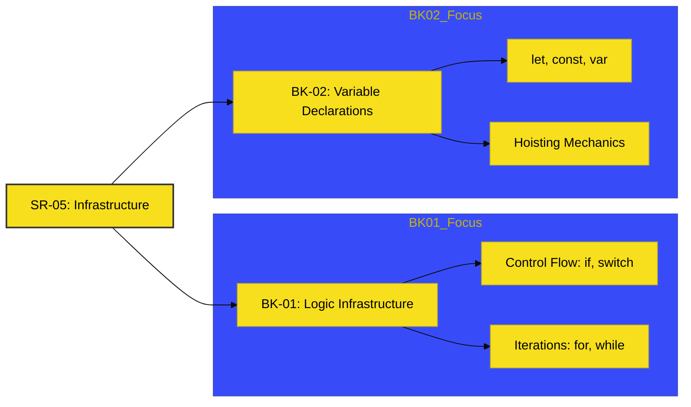

# SR-05: Statements & Declarations

> **"Infrastruktur Logika: Mengatur Alur Energi dan Reservasi Memori."**

---

## 🔗 Source Hub
- **Primary Source**: [MDN Web Docs - Statements and Declarations](https://developer.mozilla.org/en-US/docs/Web/JavaScript/Reference/Statements)
- **Technical Reference**: [ECMA-262 - Statements and Declarations](https://tc39.es/ecma262/#sec-ecmascript-language-statements-and-declarations)
- **Conceptual Parent**: [RAK-02 Foundation](../README.md)

---

## 🌓 1. Essence: The Narrative
Dalam arsitektur JavaScript, **Statements** adalah rute atau saklar yang menentukan ke mana aliran logika berjalan (seperti *loops* dan *conditionals*). Sementara itu, **Declarations** adalah cara kita memesan "brankas" atau kotak penyimpanan di dalam memori untuk menyimpan data.

Tanpa infrastruktur yang rapi di SR-05, aplikasi Anda akan mengalami kebocoran data (*data leaking*) dan alur eksekusi yang sulit diprediksi.

---

## 🗺️ 2. Landscape: The Big Picture
Sub-Rak ini terbagi menjadi dua blok infrastruktur utama:

### 🎨 Visual Logic: The Infrastructure Map

### 🏛️ Books Atlas
1.  **[BK-01: Logic Infrastructure](./BK-01_LogicInfrastructure/)**: Membangun kendali alur eksekusi dan penanganan kesalahan (*error handling*).
2.  **[BK-02: Variable Declarations](./BK-02_VariableDeclarations/)**: Mengatur pendaftaran nama, alokasi memori, dan aturan skope blok.

---

## 🧪 3. The Lab (Infrastruktur Lab)
Gunakan folder `examples/` untuk memverifikasi perbedaan perilaku antara `var`, `let`, dan `const` dalam berbagai tingkatan skope.

---

## ⚠️ 4. Common Pitfalls & Myths
- **Mitos**: *"Hoisting berarti variabel dipindahkan secara fisik ke baris atas."* (Salah, Hoisting adalah perilaku di mana mesin mencadangkan memori untuk deklarasi selama fase kompilasi, bukan pemindahan teks kode).
- **Mitos**: *"Switch selalu lebih cepat dari if-else."* (Faktanya, untuk kondisi sederhana, perbedaannya seringkali tidak signifikan; gunakan yang paling meningkatkan keterbacaan kode).

---
*Status: [x] Complete. Terminologi dan Struktur telah dinormalisasi.*
