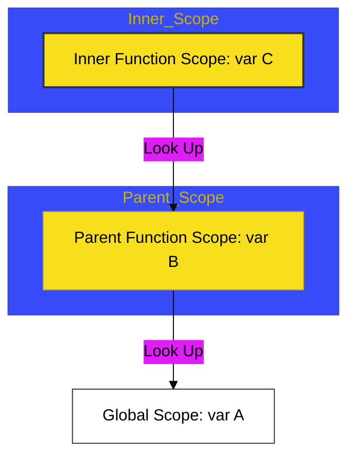

# CH-02: Lexical Scope & Scope Chain

> **"Aturan Akses: Ke Mana Fungsi Melihat untuk Menemukan Energi (Data)."**

---

## 🔗 Source Hub
- **Primary Source**: [MDN Web Docs - Scoping](https://developer.mozilla.org/en-US/docs/Glossary/Scope)
- **Technical Reference**: [ECMA-262 - Static Semantic Scoping](https://tc39.es/ecma262/#sec-static-semantic-rules)
- **Conceptual Parent**: [BK-01 Function Mechanics](../README.md)

---

## 🌓 1. Essence: The Logic
**Lexical Scoping** (atau Static Scoping) adalah aturan tetap di JavaScript di mana akses variabel ditentukan oleh letak fisik fungsi tersebut dideklarasikan di dalam kode. Jika sebuah fungsi tidak menemukan variabel di dalam lingkupnya sendiri, ia akan melihat ke lingkup luar (parent), terus naik hingga mencapai lingkup global. Alur pencarian ini disebut sebagai **Scope Chain**.

Penting untuk diingat: Fungsi "melihat keluar", bukan "melihat ke dalam" fungsi lain yang sejajar.

---

## 🎨 2. Visual Logic: The Scope Chain
Mekanisme pencarian variabel:

---

## 🧪 3. The Lab (Scope Proof)
Buktikan bagaimana **Scope Chain** bekerja dengan memverifikasi akses variabel di:
- `examples/scope_chain_lab.js`

---

## ⚠️ 4. Common Pitfalls & Myths
- **Mitos**: *"Fungsi bisa mengakses variabel di dalam fungsi lain jika keduanya dipanggil bersamaan."* (Salah, akses ditentukan oleh di mana fungsi **didefinisikan**, bukan di mana ia **dipanggil**).
- **Mitos**: *"Scope global adalah tempat terbaik untuk menyimpan data."* (Faktanya, ini adalah praktik berbahaya yang menyebabkan polusi scope dan bug tabrakan nama variabel).

---
*Back to [Function Mechanics](../README.md)*
