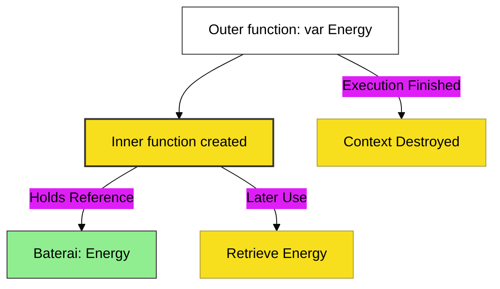

# CH-03: Closures (The Persistent Mechanism)

> **"Closures: Baterai Memori yang Memungkinkan Fungsi Membawa Data ke Masa Depan."**

---

## 🔗 Source Hub
- **Primary Source**: [MDN Web Docs - Closures](https://developer.mozilla.org/en-US/docs/Web/JavaScript/Guide/Closures)
- **Technical Reference**: [ECMA-262 - Function Definitions](https://tc39.es/ecma262/#sec-function-definitions)
- **Conceptual Parent**: [BK-01 Function Mechanics](../README.md)

---

## 🌓 1. Essence: The Logic
**Closure** adalah kemampuan sebuah fungsi untuk "mengingat" dan tetap mengakses lingkup leksikal (variabel di sekitarnya) bahkan setelah fungsi asal (induk) tersebut selesai dieksekusi. Ini dimungkinkan karena fungsi dalam (*inner function*) memegang referensi ke *Lexical Environment* tempat ia dideklarasikan.

Bayangkan sebuah fungsi induk sebagai "Ruangan" yang memiliki "Baterai" (Variabel). Saat fungsi induk selesai, ruangannya mungkin ditutup, namun fungsi dalam tetap membawa "Kabel" ke baterai tersebut.

---

## 🎨 2. Visual Logic: The Persistent Battery
Mekanisme Persistensi Memori:

---

## 🧪 3. The Lab (Closure Proof)
Buktikan persistensi memori dan enkapsulasi data melalui:
- `examples/closure_battery_lab.js`
- `examples/currying_lab.js`

---

## ⚠️ 4. Common Pitfalls & Myths
- **Mitos**: *"Closures bisa dicegah dengan mengosongkan fungsi induk."* (Salah, selama fungsi dalam masih memegang referensi, Closure akan tetap tercipta secara alami).
- **Mitos**: *"Setiap Closure menyebabkan memory leak."* (Faktanya, Closure hanya menjadi memory leak jika kita menahan referensi ke fungsi tersebut di variabel global secara tidak perlu, sehingga *Garbage Collector* tidak bisa membersihkannya).

---
*Back to [Function Mechanics](../README.md)*
