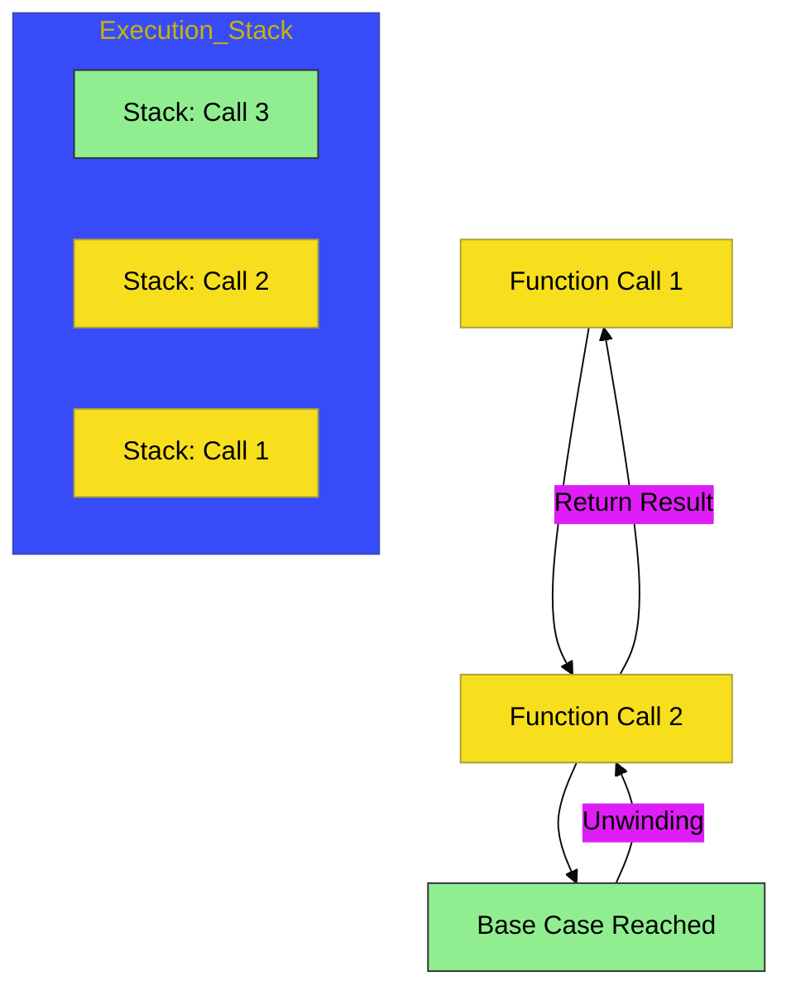

# CH-04: Recursion (Functional Loops)

> **"Memecah Masalah Besar Menjadi Replikasi Dirinya yang Lebih Kecil."**

---

## 🔗 Source Hub
- **Primary Source**: [MDN Web Docs - Recursion](https://developer.mozilla.org/en-US/docs/Glossary/Recursion)
- **Technical Reference**: [ECMA-262 - Call Stack & Execution Context](https://tc39.es/ecma262/#sec-execution-contexts)
- **Conceptual Parent**: [BK-01 Function Mechanics](../README.md)

---

## 🌓 1. Essence: The Logic
**Recursion** adalah teknik di mana sebuah fungsi memanggil dirinya sendiri secara berulang untuk menyelesaikan masalah hingga mencapai kondisi henti yang disebut **Base Case**. Tanpa base case, fungsi akan memanggil dirinya selamanya dan menyebabkan kesalahan **Stack Overflow**.

Rekursi sangat efektif untuk menangani data yang memiliki struktur bertingkat (seperti pohon folder, menu navigasi bertingkat, atau objek JSON kompleks).

---

## 🎨 2. Visual Logic: The Call Stack
Aliran rekursi dan tumpukan eksekusi:

---

## 🧪 3. The Lab (Recursion Lab)
Lakukan pembuktian dekonstruksi masalah bertingkat di:
- `examples/recursion_lab.js`

---

## ⚠️ 4. Common Pitfalls & Myths
- **Mitos**: *"Recursion adalah pengganti loop for/while di semua kasus."* (Salah, rekursi memakan ruang di **Call Stack**; untuk jutaan pengulangan sederhana, loop tradisional jauh lebih aman dan efisien).
- **Mitos**: *"Recursion itu membingungkan."* (Kuncinya adalah mendefinisikan **Base Case** terlebih dahulu sebelum memikirkan logika rekursifnya).

---
*Back to [Function Mechanics](../README.md)*
