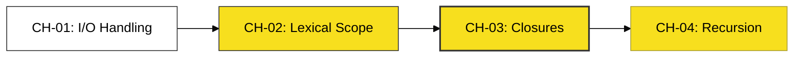

# BK-01: Function Mechanics

> **"Membedah Sistem Transmisi: Dari Input Hingga Persistensi Memori."**

---

## 🔗 Source Hub
- **Primary Source**: [MDN Web Docs - Functions](https://developer.mozilla.org/en-US/docs/Web/JavaScript/Guide/Functions)
- **Technical Reference**: [ECMA-262 - Function Definitions](https://tc39.es/ecma262/#sec-function-definitions)
- **Conceptual Parent**: [SR-06 Functions](../README.md)

---

## 🌓 1. Essence: The Narrative
Mekanika fungsi adalah tentang bagaimana data mengalir masuk, diolah di dalam "atap" leksikal yang aman, dan bagaimana hasil olahannya dipertahankan. Di sini kita membedah transmisi parameter, aturan akses variabel melalui **Scope Chain**, hingga keajaiban **Closures** yang memungkinkan fungsi "mengingat" lingkungannya bahkan setelah operasinya selesai.

---

## 🗺️ 2. Landscape: The Big Picture
Unit-unit mekanika di dalam buku ini:

### 🎨 Visual Logic: The Operational Flow

### 🏛️ Table of Materials
| Bab | Judul | Status | Visual | Lab |
| :--- | :--- | :--- | :---: | :---: |
| **CH-01** | [I/O Handling (Params & Returns)](./CH-01_InputOutput/) | [x] Complete | [x] Mermaid | [x] Lab |
| **CH-02** | [Lexical Scope & Scope Chain](./CH-02_LexicalScope/) | [x] Complete | [x] Mermaid | [x] Lab |
| **CH-03** | [Closures (The Persistent Mechanism)](./CH-03_Closures/) | [x] Complete | [x] Mermaid | [x] Lab |
| **CH-04** | [Recursion (Functional Loops)](./CH-04_Recursion/) | [x] Complete | [x] Mermaid | [x] Lab |

---

## 🧪 3. The Lab (Mechanics Proof)
Gunakan folder `examples/` di setiap Bab untuk membuktikan bagaimana **Scope Chain** bekerja dan memverifikasi persistensi data pada **Closures**.

---

## ⚠️ 4. Common Pitfalls & Myths
- **Mitos**: *"Setiap fungsi memiliki kopian memorinya sendiri."* (Faktanya, fungsi menggunakan **Lexical Scoping** untuk merujuk ke data yang sudah ada di memori sekitarnya).
- **Mitos**: *"Recursion selalu lebih lambat dari loop biasa."* (Bergantung pada mesin, namun rekursi seringkali memberikan kejelasan arsitektur yang lebih baik untuk masalah yang bersifat bertingkat).

---
*Status: [/] Partial. Sedang dalam tahap normalisasi hierarki Bab (CH).*
