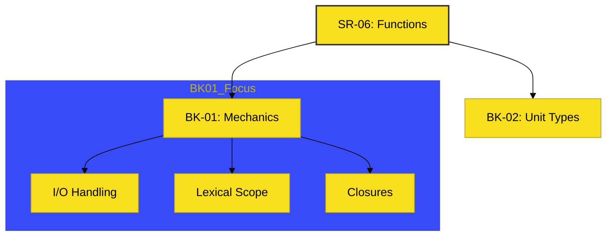

# SR-06: Functions (The Operational Units)

> **"Jantung Modularitas: Mengemas Logika dalam Unit Kerja yang Presisi."**

---

## 🔗 Source Hub
- **Primary Source**: [MDN Web Docs - Functions Guide](https://developer.mozilla.org/en-US/docs/Web/JavaScript/Guide/Functions)
- **Technical Reference**: [ECMA-262 - Function Definitions](https://tc39.es/ecma262/#sec-function-definitions)
- **Conceptual Parent**: [RAK-02 Foundation](../README.md)

---

## 🌓 1. Essence: The Narrative
Jika data adalah energi, maka **Function** adalah unit operasi yang menerima muatan, mengolahnya, lalu mengirimkan hasilnya kembali ke grid. Di level fondasi ini, kita membedah bagaimana fungsi tidak hanya sekadar blok kode, melainkan mekanisme yang menjaga keamanan data melalui **Scoping** dan memungkinkan persistensi memori melalui **Closures**.

Pembedahan SR-06 dibagi menjadi dua arsitektur besar: **Mekanika Fungsi** (Bagaimana ia bekerja di dalam) dan **Variasi Unit** (Bagaimana ia dideklarasikan secara modern).

---

## 🗺️ 2. Landscape: The Big Picture
Berikut adalah dekonstruksi buku di dalam Sub-Rak ini:

### 🎨 Visual Logic: The Functional Flow

### 🏛️ Books Atlas
1.  **[BK-01: Function Mechanics](./BK-01_FunctionMechanics/)**: Membedah transmisi input/output, rantai skope, dan persistensi memori.
2.  **[BK-02: Unit Types](./BK-02_UnitTypes/)**: Membedah variasi sintaks modern (Arrow, Declarations, IIFE).

---

## 🧪 3. The Lab (Functional Lab)
Buka setiap folder `examples/` di dalam bab untuk melihat bagaimana fungsi digunakan dalam enkapsulasi data dan alur kerja asinkron.

---

## ⚠️ 4. Common Pitfalls & Myths
- **Mitos**: *"Arrow functions bisa menggantikan semua function tradisional."* (Faktanya, Arrow functions tidak memiliki `this` sendiri, yang bisa menjadi masalah pada pola OOP tertentu).
- **Mitos**: *"Closures merusak performa memori."* (Faktanya, Closures adalah fitur desain bahasa; memori hanya menjadi masalah jika kita menahan referensi yang tidak lagi dibutuhkan).

---
*Status: [/] Partial. Struktur sedang ditingkatkan ke Adaptive Gold Standard.*
