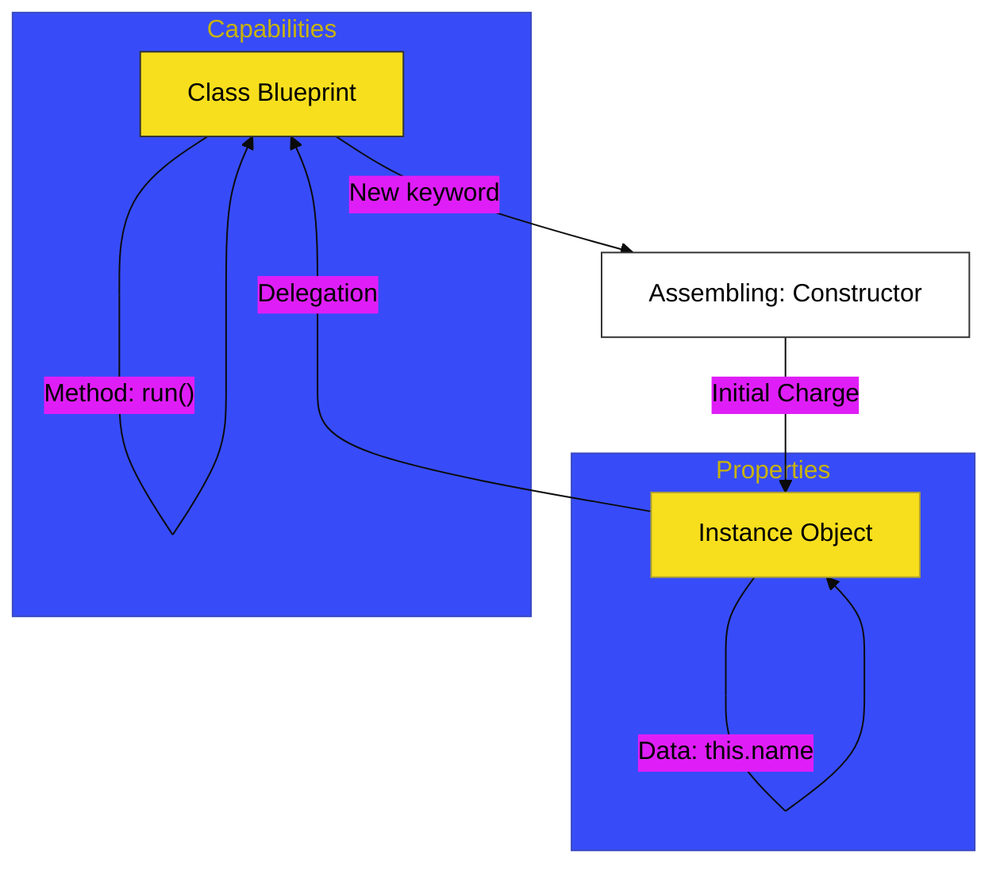

# CH-01: The Blueprint

> **"Cetak Biru Kelas: Merancang Struktur dan Kemampuan Unit Secara Modular."**

---

## 🔗 Source Hub
- **Primary Source**: [MDN Web Docs - Classes](https://developer.mozilla.org/en-US/docs/Web/JavaScript/Reference/Classes)
- **Technical Reference**: [ECMA-262 - Class Definitions](https://tc39.es/ecma262/#sec-class-definitions)
- **Conceptual Parent**: [BK-01 Class Foundations](../README.md)

---

## 🌓 1. Essence: The Logic
Dalam arsitektur modern, kita memerlukan cara yang bersih untuk membuat banyak objek yang memiliki pola yang sama. **Classes** di JavaScript bertindak sebagai **Blueprint** (Cetak Biru). Di **CH-01**, kita membedah mekanisme internal bagaimana blueprint ini dideklarasikan dan bagaimana **Constructor** digunakan sebagai "Jalur Perakitan" awal saat sebuah unit baru diciptakan.

Meskipun terlihat seperti kelas di bahasa lain, ingatlah bahwa di bawah tenda, JavaScript tetap menggunakan **Prototypal Delegation** untuk membagikan kemampuan (*Methods*) antar instance.

---

## 🎨 2. Visual Logic: The Class Construction Flow
Mekanisme perakitan dari deklarasi hingga penciptaan instance:

---

## 🏛️ 3. Sections Atlas
- **[SEC-01: Class Declarations](./SEC-01_ClassDeclarations/)**: Membedah teknik deklarasi bentuk utama class dan perannya dalam arsitektur modern.
- **[SEC-02: Constructors](./SEC-02_Constructors/)**: Meninjau jalur perakitan awal dan inisialisasi status unit.
- **[SEC-03: Methods](./SEC-03_Methods/)**: Menjelaskan bagaimana kemampuan operasional dibagikan secara efisien melalui prototipe.

---

## 🧪 4. The Lab (Assembly Lab)
Uji ketajaman perakitan sirkuit awal Anda di laboratorium:
- `../examples/class_blueprint_demo.js`

---

## ⚠️ 5. Common Pitfalls & Myths
- **Mitos**: *"Class adalah tipe data baru di JavaScript."* (Salah, `typeof ClassName` akan mengembalikan `"function"`. Class hanyalah *Syntax Sugar* tingkat lanjut di atas fungsi konstruktor).
- **Mitos**: *"Konstruktor wajib dideklarasikan."* (Faktanya, jika Anda tidak menulisnya, JavaScript akan menyediakan **Default Constructor** kosong secara otomatis di belakang layar).

---
*Back to [Class Foundations](../README.md)*
