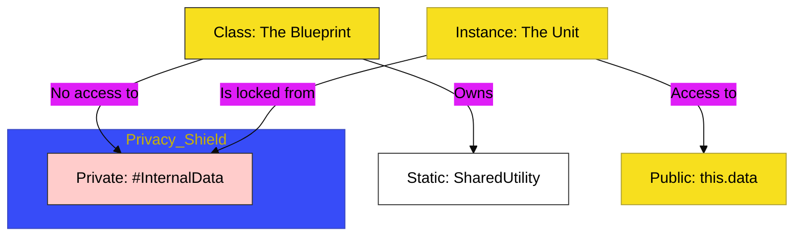

# CH-02: Access Logic

> **"Gerbang Akses: Mengatur Jalur Visibilitas Data dan Utilitas Bersama."**

---

## 🔗 Source Hub
- **Primary Source**: [MDN Web Docs - Classes: Private class features](https://developer.mozilla.org/en-US/docs/Web/JavaScript/Reference/Classes/Private_class_features)
- **Technical Reference**: [ECMA-262 - Static Semantics: IsStatic](https://tc39.es/ecma262/#sec-static-semantics-isstatic)
- **Conceptual Parent**: [BK-01 Class Foundations](../README.md)

---

## 🌓 1. Essence: The Logic
Setelah cetak biru terbentuk, arsitek harus menentukan siapa yang boleh melihat atau mengubah bagian tertentu dari unit. **Access Logic** di **CH-02** membedah penggunaan **Private Fields** (`#`) yang mengunci data di dalam sirkuit internal, dan **Static Members** yang bertindak sebagai fasilitas bersama tingkat tinggi yang menempel pada blueprint itu sendiri.

Memahami kontras visibilitas ini memungkinkan Anda membangun sistem yang tangguh, di mana *state* internal tidak bisa dimanipulasi sembarangan dari luar, sehingga integritas Hub aplikasi tetap terjaga.

---

## 🎨 2. Visual Logic: Data Visibility Hierarchy
Hierarki akses dan visibilitas data di dalam arsitektur kelas:

---

## 🏛️ 3. Sections Atlas
- **[SEC-01: Private Fields](./SEC-01_PrivateFields/)**: Membedah teknik penguncian data internal menggunakan awalan `#`.
- **[SEC-02: Static Members](./SEC-02_StaticMembers/)**: Meninjau fasilitas bersama yang hidup di level blueprint, bukan di level instance.
- **[SEC-03: Getters & Setters](./SEC-03_GettersSetters/)**: Menjelaskan gerbang baca-tulis yang memungkinkan validasi data sebelum diakses.

---

## 🧪 4. The Lab (Access Lab)
Uji ketajaman penguncian dan utilitas statis di laboratorium:
- `../examples/access_logic_demo.js`

---

## ⚠️ 5. Common Pitfalls & Myths
- **Mitos**: *"Menambahkan garis bawah (`_`) di depan properti benar-benar membuatnya privat."* (Salah, itu hanyalah konvensi sosial. Hanya **Private Fields** (`#`) yang memberikan keamanan fisik di level engine JavaScript).
- **Mitos**: *"Static members bisa diakses dari instance."* (Faktanya, anggota statis **hanya** bisa dipanggil melalui nama kelasnya langsung, tidak bisa melalui unit hasil rakitan/instance).

---
*Back to [Class Foundations](../README.md)*
