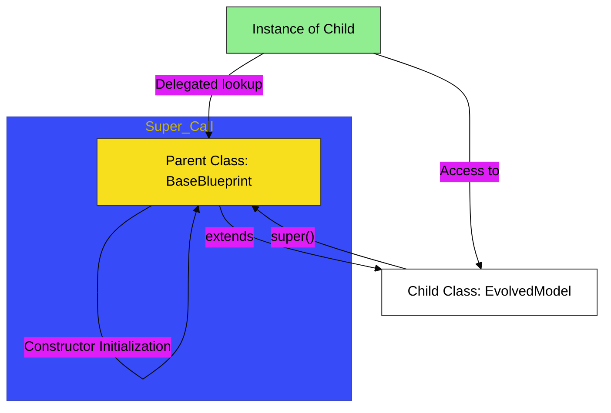

# CH-01: Inheritance Extension

> **"Evolusi Cetak Biru: Memperluas dan Menyesuaikan Perilaku Model Dasar."**

---

## 🔗 Source Hub
- **Primary Source**: [MDN Web Docs - Classes: Inheritance](https://developer.mozilla.org/en-US/docs/Web/JavaScript/Reference/Classes#inheritance)
- **Technical Reference**: [ECMA-262 - Class Definitions: Runtime Semantics: ClassDefinitionEvaluation](https://tc39.es/ecma262/#sec-class-definitions-runtime-semantics-classdefinitionevaluation)
- **Conceptual Parent**: [BK-02 Model Evolution](../README.md)

---

## 🌓 1. Essence: The Logic
Arsitektur yang cerdas tidak perlu membangun semuanya dari nol. **Inheritance** (Pewarisan) memungkinkan kita untuk mengambil blueprint dasar yang sudah stabil dan memperluasnya menjadi varian baru yang lebih spesifik. Di **BK-02/CH-01**, kita membedah penggunaan **extends** untuk menghubungkan rantai prototipe, dan **super** untuk memanggil sirkuit orisinal dari kelas induk.

Memahami bagaimana **Polymorphism** bekerja memungkinkan Anda menyesuaikan perilaku unit turunan tanpa harus mengubah antarmuka umum, sehingga Hub aplikasi tetap fleksibel namun terorganisir secara hierarkis.

---

## 🎨 2. Visual Logic: The Inheritance Tree & Super Link
Mekanisme delegasi dan alur pemanggilan konstruktor melalui hierarki pewarisan:

---

## 🏛️ 3. Sections Atlas
- **[SEC-01: Extends](./SEC-01_Extends/)**: Membedah teknik penghubungan blueprint turunan ke model dasar.
- **[SEC-02: Super](./SEC-02_Super/)**: Meninjau jalur pemanggilan konstruktor dan metode milik induk.
- **[SEC-03: Polymorphism](./SEC-03_PolymorphismRef/)**: Menjalaskan penyesuaian perilaku turunan dengan tetap konsisten pada antarmuka model induk.

---

## 🧪 4. The Lab (Inheritance Lab)
Uji ketajaman evolusi dan delegasi super di laboratorium:
- `../examples/inheritance_evolution_demo.js`

---

## ⚠️ 5. Common Pitfalls & Myths
- **Mitos**: *"Child class tidak butuh `super()` jika tidak ada konstruktor."* (Faktanya, jika Anda menulis konstruktor baru di child class, memanggil **`super()`** adalah kewajiban mutlak sebelum mengakses **`this`**, atau engine akan mematikan sirkuit aplikasi Anda dengan error).
- **Mitos**: *"Semakin dalam tingkat pewarisan, semakin baik arsitekturnya."* (Sangat berbahaya; arsitek profesional menyukai **komposisi** daripada pewarisan yang terlalu dalam (*Deep Inheritance Trees*) karena pewarisan yang terlalu kompleks akan sulit di-debug).

---
*Back to [Model Evolution](../README.md)*
