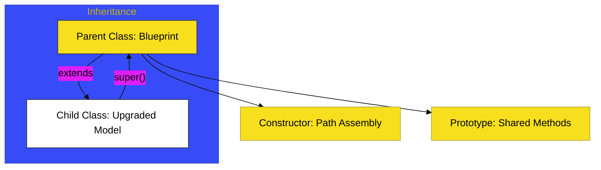

# SR-07: Classes (The Blueprint System)

> **"Sistem Cetak Biru: Menyatukan Data dan Perilaku ke Dalam Bentuk yang Konsisten."**

---

## 🔗 Source Hub
- **Primary Source**: [MDN Web Docs - Classes Guide](https://developer.mozilla.org/en-US/docs/Web/JavaScript/Reference/Classes)
- **Technical Reference**: [ECMA-262 - Class Definitions](https://tc39.es/ecma262/#sec-class-definitions)
- **Conceptual Parent**: [RAK-02 Foundation](../README.md)

---

## 🌓 1. Essence: The Narrative
Dalam arsitektur modern, **Classes** adalah evolusi dari sistem prototipe tradisional yang memberikan cara lebih bersih untuk mendefinisikan "Blueprint" (Cetak Biru) sebuah objek. Jika fungsi adalah unit operasi, maka class adalah jalur perakitan yang menyatukan data (properties) dan kemampuan operasional (methods) ke dalam satu unit yang rapi dan terukur.

Penguasaan SR-07 adalah tentang **Arsitektur Model**. Memahami bagaimana blueprint dibuat, diatur aksesnya (`private/static`), dan bagaimana ia diturunkan (*Inheritance*) tanpa merusak integritas unit asal.

---

## 🗺️ 2. Landscape: The Big Picture
Sub-Rak ini membagi desain cetak biru menjadi dua buku utama:

### 🎨 Visual Logic: The Prototype & Class Hierarchy

### 🏛️ Books Atlas
1.  **[BK-01: Class Foundations](./BK-01_ClassFoundations/)**: Membangun fondasi class modern (constructors, methods) dan logika akses internal (private fields, static members).
2.  **[BK-02: Model Evolution](./BK-02_ModelEvolution/)**: Membahas bagaimana blueprint berkembang melalui pewarisan (extends), polimorfisme, dan penggunaan kata kunci `super`.

---

## 🧪 3. The Lab (Blueprint Lab)
Masuk ke setiap Bab untuk melihat bagaimana class digunakan untuk membangun model data yang aman dan memperluas perilaku unit di dalam Hub.

---

## ⚠️ 4. Common Pitfalls & Myths
- **Mitos**: *"Class mengubah JavaScript menjadi bahasa Class-based seperti Java."* (Salah, secara teknis class hanyalah *Syntax Sugar* di atas **Prototypal Inheritance** yang tetap berjalan di belakang layar).
- **Mitos**: *"Private fields (`#`) hanyalah konvensi penamaan."* (Faktanya, `#` memberikan privasi tingkat bahasa yang sesungguhnya dan tidak bisa diakses dari luar lingkup class).

---
*Status: [x] Complete. Struktur dan Visual telah diselaraskan ke Adaptive Gold Standard.*
