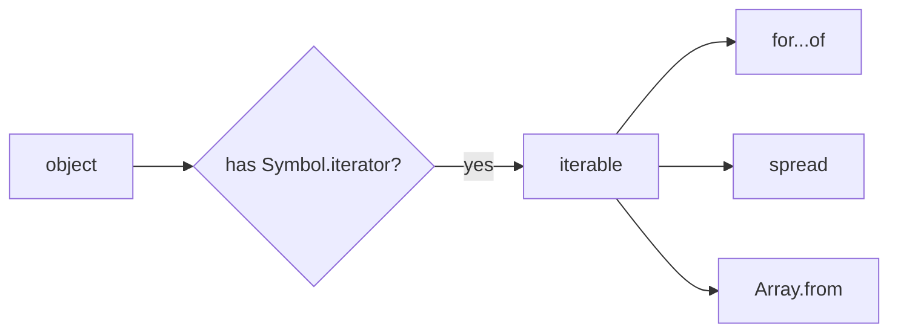

# SEC-01: The Iterable Protocol (The Universal Transport)

> **"Di dalam Hub, energi tidak selalu dilepaskan sekaligus. Seringkali, energi harus mengalir melalui 'Jalur Standar' (Standard Track) yang memungkinkan data diambil satu per satu secara teratur. Iterable Protocol adalah kontrak yang menentukan apakah suatu objek boleh masuk ke jalur ini."**

**Iterable Protocol** adalah aturan main yang memungkinkan objek JavaScript untuk mendefinisikan perilaku iterasi mereka sendiri. Jika sebuah objek mengikuti protokol ini, ia dapat "mengalir" melalui berbagai alat bawaan JavaScript yang dirancang untuk menangani urutan data.

## Source Hub
- [MDN Web Docs - Iteration protocols](https://developer.mozilla.org/en-US/docs/Web/JavaScript/Reference/Iteration_protocols)
- [MDN Web Docs - Symbol.iterator](https://developer.mozilla.org/en-US/docs/Web/JavaScript/Reference/Global_Objects/Symbol/iterator)

---

## 1. Mental Model: "The Universal Transport"

Bayangkan sebuah kontainer data besar. Agar data di dalamnya bisa dipindahkan menggunakan sistem transportasi otomatis Hub (seperti ban berjalan), kontainer tersebut harus memiliki pintu gerbang khusus berlabel `[Symbol.iterator]`. 

Jika pintu gerbang ini ada, maka objek tersebut dianggap "Iterable" (Bisa Dialirkan). Sinyal dari gerbang ini akan memanggil unit **Iterator** yang akan mengambil data satu per satu sampai habis.

---

## 2. Syarat Kontrak: `[Symbol.iterator]`

Sebuah objek sah menjadi iterable jika ia memiliki properti dengan kunci `Symbol.iterator`. Nilai dari properti tersebut harus berupa sebuah fungsi yang mengembalikan sebuah **Iterator** (pemandu jalan).

Objek bawaan yang sudah memiliki gerbang ini secara default:
- **Array**: Aliran elemen berurutan.
- **String**: Aliran karakter satu per satu.
- **Map & Set**: Aliran pasangan kunci-nilai atau nilai unik.
- **Arguments**: Aliran parameter fungsi.

---

## 3. Kompatibilitas Jalur Standar

Sekali sebuah objek menjadi iterable, ia dapat digunakan dengan berbagai instrumen canggih di Hub:
- **`for...of` Loop**: Mengalirkan data satu per satu ke dalam blok kode.
- **Spread Operator (`[...]`)**: Menyebarkan aliran data ke dalam array baru.
- **Destructuring**: Mengambil beberapa data awal dari aliran.
- **`Array.from()`**: Mengubah aliran data menjadi array statis.

---

## Arsitek Mindset: Standarisasi Aliran

Sebagai arsitek Hub:
- **Custom Structures**: Gunakan iterable protocol untuk membuat struktur data kustom Anda (misal: LinkedList atau Tree) menjadi kompatibel dengan alat-alat standar JavaScript.
- **Predictability**: Selalu pastikan `[Symbol.iterator]` mengembalikan iterator yang valid agar sistem transportasi data tidak mengalami macet (*runtime error*).
- **Efficiency**: Dengan menggunakan protokol ini, Anda memungkinkan pemrosesan data secara bertahap (lazy evaluation) daripada harus memuat seluruh data ke memori sekaligus.

---

## Hands-on: Lab Jalur Standar
Eksperimen dengan verifikasi gerbang `[Symbol.iterator]` pada berbagai unit data di `examples/iterable_check_lab.js`.

---
*Status: [status.md](../../../status.md)*
