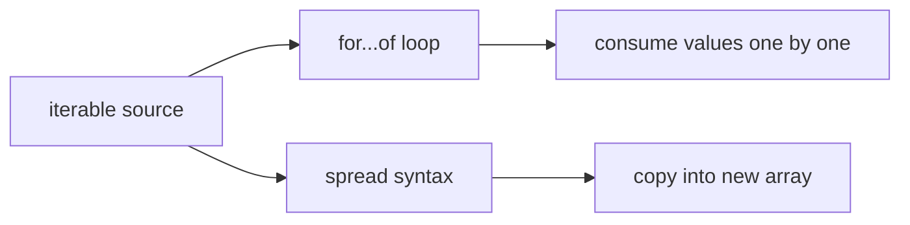

# SEC-03: for...of & Spread (The Content Harvesters)

> **"Menekan tombol `next()` secara manual mungkin melelahkan untuk aliran energi besar. JavaScript menyediakan 'Pemanen Konten' (Content Harvesters) dalam bentuk `for...of` dan Spread Operator yang secara otomatis mengelola seluruh protokol iterasi di balik layar."**

Gula sintaksis ini memudahkan kita memproses objek yang sudah tersertifikasi sebagai **Iterable**. Mereka adalah konsumen otomatis yang akan menarik data sampai sinyal `done: true` diterima.

## Source Hub
- [MDN Web Docs - for...of](https://developer.mozilla.org/en-US/docs/Web/JavaScript/Reference/Statements/for...of)
- [MDN Web Docs - Spread syntax](https://developer.mozilla.org/en-US/docs/Web/JavaScript/Reference/Operators/Spread_syntax)
- [MDN Web Docs - Iteration protocols](https://developer.mozilla.org/en-US/docs/Web/JavaScript/Reference/Iteration_protocols)

---

## 1. Mental Model: "The Content Harvesters"

Bayangkan sebuah ladang data yang sudah terhubung ke gerbang `Symbol.iterator`. Anda tidak perlu menarik data satu per satu; cukup gunakan alat pemanen otomatis:
- **`for...of`**: Seperti truk pengumpul yang berjalan menyusuri baris data dan memasukkannya ke dalam variabel untuk segera diproses.
- **Spread Operator (`...`)**: Seperti kipas besar yang meniup seluruh isi kontainer data dan menyebarkannya ke dalam wadah (array) baru.




---

## 2. Bedah Alat Pemanen

### A. Pengulangan `for...of`
Alat paling efisien untuk memproses nilai dari iterable. Ia secara otomatis mengekstrak `.value` dan berhenti seketika saat `.done` bernilai `true`.

```javascript
const gridUnits = ["Alpha", "Beta", "Gamma"];

for (const unit of gridUnits) {
    console.log(`Harvesting energy from: ${unit}`);
}
```

### B. Spread Operator `[...]`
Sangat berguna untuk penggabungan data atau konversi cepat dari iterable (seperti NodeList atau Set) ke dalam Array standar.

```javascript
const staticData = [...gridUnits, "Delta"]; // ["Alpha", "Beta", "Gamma", "Delta"]
```

---

## 3. Peringatan: `for...of` vs `for...in`

Sebagai arsitek Hub, jangan sampai tertukar:
- **`for...in`**: Memanen **KUNCI/INDEKS** (Properti objek). Cocok untuk inspeksi struktur.
- **`for...of`**: Memanen **NILAI** (Konten iterable). Cocok untuk pemrosesan data.

---

## Arsitek Mindset: Otomasi Grid

Sebagai arsitek Hub:
- **Clean Loops**: Gunakan `for...of` untuk menjaga kode tetap bersih dari pengelolaan indeks manual (`i++`).
- **Destructuring Harvest**: Anda bisa mengombinasikan `for...of` dengan destructuring untuk memanen data yang kompleks (misal: `for (const [id, val] of map) { ... }`).
- **One-Way Consumption**: Ingat bahwa beberapa iterable (seperti Generators) bersifat sekali panen. Begitu selesai dipanen oleh `for...of`, mereka tidak bisa dipanen lagi.

---

## Hands-on: Lab Ban Berjalan Otomatis
Bandingkan efisiensi pemanenan data menggunakan berbagai instrumen otomatis di `examples/conveyor_lab.js`.

---
*Status: [status.md](../../../status.md)*
