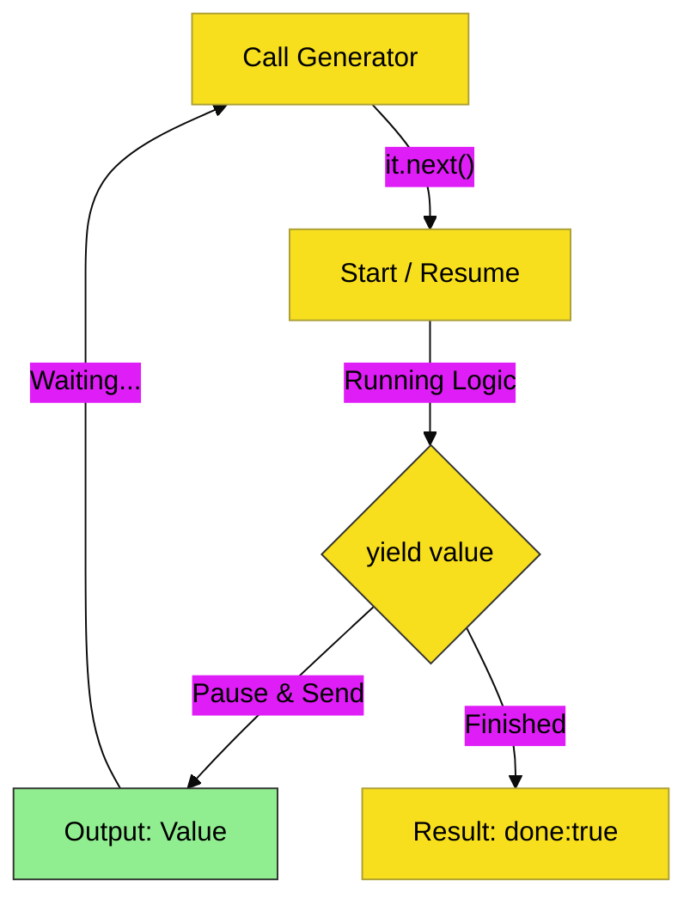

# CH-02: Generator Pulses

> **"Denyut Generator: Mengontrol Ritme Aliran dengan Pause & Resume."**

---

## 🔗 Source Hub
- **Primary Source**: [MDN Web Docs - Iterators and generators](https://developer.mozilla.org/en-US/docs/Web/JavaScript/Guide/Iterators_and_Generators#generators)
- **Technical Reference**: [ECMA-262 - Generator Objects](https://tc39.es/ecma262/#sec-generator-objects)
- **Conceptual Parent**: [BK-01 Sequence Management](../README.md)

---

## 🌓 1. Essence: The Logic
Tidak semua proses harus berjalan sampai selesai dalam satu nafas. **Generators** adalah alat khusus JavaScript untuk membuat fungsi yang bisa dihentikan sementara, mengirimkan satu nilai (*yield*), dan kemudian melanjutkan kembali (*resume*) tepat dari titik terakhirnya saat diminta.

Memahami "Denyut" (*Pulse*) ini memberikan Anda kontrol penuh atas ritme aliran data Hub, memungkinkan Anda mengolah sumber data besar secara bertahap tanpa membebani memori, serta menjembatani alur asinkron di masa depan.

---

## 🎨 2. Visual Logic: The Step-by-Step Pulse Cycle
Mekanisme siklus henti-lanjut di dalam generator:

---

## 🏛️ 3. Sections Atlas
- **[SEC-01: Generator Functions](./SEC-01_GeneratorFunctions/)**: Membedah teknik deklarasi mesin generator menggunakan tanda bintang (`*`).
- **[SEC-02: The yield Keyword](./SEC-02_YieldKeyword/)**: Meninjau mekanisme pengiriman nilai dan penghentian denyut sementara.
- **[SEC-03: yield*](./SEC-03_YieldDelegation/)**: Menjelaskan teknik delegasi aliran data ke generator atau iterable lain.
- **[SEC-04: Async Iterators](./SEC-04_AsyncIteratorsRef/)**: Peta transisi menuju aliran data bertahap yang bersifat asinkron (Jembatan RAK-05).

---

## 🧪 4. The Lab (Pulse Lab)
Uji ketajaman ritme aliran data bertahap di laboratorium:
- `../examples/generator_pulse_demo.js`

---

## ⚠️ 5. Common Pitfalls & Myths
- **Mitos**: *"Generator adalah thread baru."* (Salah, JavaScript tetap berjalan pada **Single Thread**; generator hanyalah cara untuk "menggantung" (*suspend*) eksekusi fungsi tanpa memblokir thread utama).
- **Mitos**: *"Sekali generator selesai, ia bisa digunakan lagi."* (Faktanya, objek generator adalah unit **Satu Kali Pakai**; jika statusnya sudah `done: true`, Anda harus membuat instance generator baru dari fungsi aslinya jika ingin mengulangi aliran).

---
*Back to [Sequence Management](../README.md)*
