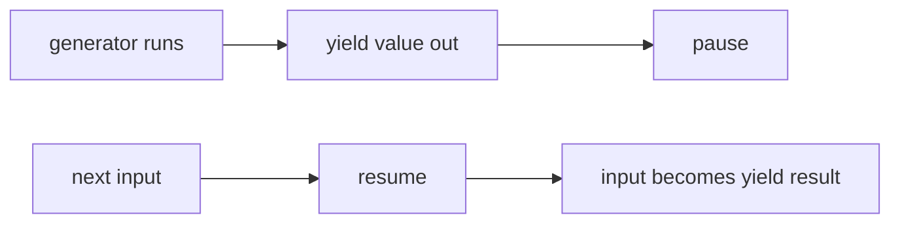

# SEC-02: The yield Keyword (The Flow Regulator)

> **"Generator hanyalah sebuah mesin statis tanpa adanya 'Regulator Arus' (Flow Regulator). Kata kunci `yield` adalah gerbang dua arah yang tidak hanya mengeluarkan energi, tapi juga bisa menerima masukan kembali dari luar untuk menyesuaikan ritme kerja unit secara dinamis."**

`yield` adalah instrumen paling krusial dalam fungsi generator. Ia bukan sekadar perintah `return` yang berhenti di tengah jalan, melainkan sebuah titik pertukaran data dua arah.

## Source Hub
- [MDN Web Docs - yield](https://developer.mozilla.org/en-US/docs/Web/JavaScript/Reference/Operators/yield)
- [MDN Web Docs - function*](https://developer.mozilla.org/en-US/docs/Web/JavaScript/Reference/Statements/function*)

---

## 1. Mental Model: "The Flow Regulator"

Bayangkan sebuah gerbang regulator di bendungan energi Hub. 
1. **Output (Push)**: Saat gerbang dibuka (`yield data`), energi dikirimkan keluar menuju konsumen (penerima `next()`).
2. **Suspension**: Setelah pengiriman, gerbang tetap terbuka sebagian, membekukan seluruh kondisi mesin internal generator.
3. **Input (Pull)**: Operator Hub bisa melemparkan paket instruksi balik ke dalam gerbang tersebut saat memberikan perintah lanjut (`next(feedback)`). Instruksi ini akan ditangkap oleh variabel internal di sisi kiri `yield`.




---

## 2. Komunikasi Dua Arah (Ping-Pong)

Cara kerja pertukaran ini sangat unik:
- **Langkah 1**: Panggil `next()` pertama kali untuk menyalakan mesin. (Input apa pun di sini diabaikan karena belum ada `yield` yang menunggu).
- **Langkah 2**: Mesin berjalan sampai `yield X`, lalu mengirimkan `X` keluar.
- **Langkah 3**: Panggil `next(Y)`. Nilai `Y` akan menggantikan ekspresi `yield` di dalam fungsi dan disimpan ke variabel.

```javascript
function* powerProcessor() {
    const feedback = yield "Requesting System Check..."; // Push out data
    console.log(`System Status Received: ${feedback}`); // Pull in data
}

const proc = powerProcessor();
proc.next(); // Start & Push
proc.next("ALL-SYSTEMS-GREEN"); // Pull & Continue
```

---

## 3. Kendali Darurat: `.throw()` & `.return()`

Selain `next()`, operator Hub memiliki dua tombol darurat:
- **`.throw(error)`**: Menyuntikkan kegagalan langsung ke titik `yield` terakhir. Ini memungkinkan generator menangani error secara internal menggunakan `try...catch`.
- **`.return(value)`**: Menghentikan generator secara paksa dan menetapkan status `done: true`.

---

## Arsitek Mindset: Dinamika Arus

Sebagai arsitek Hub:
- **Interactive Workflows**: Gunakan `yield` untuk membangun alur kerja yang membutuhkan konfirmasi dari sistem lain atau pengguna di tiap fasenya.
- **Middleware Logic**: Generator sangat kuat untuk membangun rantai logika yang bisa di-intercept atau dimodifikasi di tengah jalan.
- **Error Resiliency**: Selalu lengkapi generator interaktif Anda dengan blok `try...catch` di sekitar `yield` untuk menangani sinyal `.throw()` dari sistem pusat.

---

## Hands-on: Lab Gerbang Kontrol
Eksperimen dengan percakapan dua arah antara Anda dan mesin generator di `examples/yield_flow_lab.js`.

---
*Status: [status.md](../../../status.md)*
