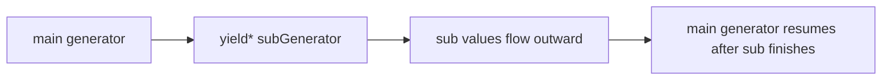

# SEC-03: yield* (The Sub-Grid Relay)

> **"Terkadang, sebuah generator utama tidak perlu memproses semua energi sendiri. Ia bisa mengalihkan aliran tugas ke generator pembantu lainnya. `yield*` adalah 'Relay Sub-Grid' (Sub-Grid Relay) yang menyambungkan aliran dari generator satu langsung ke generator lainnya sampai sub-proses tersebut selesai."**

Ekspresi **`yield*`** digunakan untuk mendelegasikan proses iterasi ke objek **Iterable** lain. Ini memungkinkan sebuah generator untuk memanggil generator lain (atau iterable apa pun) dan mengalirkan seluruh nilainya seolah-olah nilai tersebut berasal dari dirinya sendiri.

## Source Hub
- [MDN Web Docs - yield*](https://developer.mozilla.org/en-US/docs/Web/JavaScript/Reference/Operators/yield*)
- [MDN Web Docs - function*](https://developer.mozilla.org/en-US/docs/Web/JavaScript/Reference/Statements/function*)

---

## 1. Mental Model: "The Sub-Grid Relay"

Bayangkan Hub memiliki **Generator Induk** yang mengelola seluruh Grid. 
- Saat tiba waktunya untuk memproses Sektor Baterai, ia tidak perlu menulis ulang logika pemrosesan baterai di dalam blueprint utamanya.
- Ia cukup menggunakan `yield* batteryProcessor()`.
- Secara otomatis, "Ban Berjalan" dari Sektor Baterai disambungkan langsung ke jalur output utama Hub. Semua data dari baterai akan mengalir keluar melalui delegasi ini.




---

## 2. Karakteristik Delegasi

`yield*` bekerja dengan hampir semua jenis iterable:
- **Generator Lain**: Mengalirkan semua `yield` dari generator target.
- **Array**: Mengalirkan setiap elemen array satu per satu (otomatis flattening).
- **String**: Mengalirkan setiap karakter satu per satu.

```javascript
function* main() {
    yield "Start";
    yield* [1, 2, 3]; // Delegasi ke Array
    yield "End";
}
```

---

## 3. Menangkap Hasil Kembalian (Return Value)

Salah satu fitur canggih dari `yield*` adalah ia bisa menangkap nilai yang di-`return` oleh generator yang didelegasikan. Ini memungkinkan sub-proses memberikan laporan akhir ke proses utama.

```javascript
function* sub() {
    yield "Work";
    return "SUCCESS-REPORT";
}

function* main() {
    const report = yield* sub();
    console.log(`Sub-process finished with: ${report}`);
}
```

---

## Arsitek Mindset: Struktur Modular

Sebagai arsitek Hub:
- **Modular Design**: Gunakan `yield*` untuk memecah prosedur generator yang sangat panjang menjadi beberapa potongan kecil (sub-modules) yang lebih mudah diuji dan dikelola.
- **Recursive Streams**: `yield*` sangat kuat untuk menangani struktur data rekursif (seperti Folder di dalam Folder) dengan tetap menjaga aliran data tetap linear bagi konsumen.
- **Readability**: Delegasi ini membantu menjaga generator utama tetap pendek dan lebih mudah diikuti dibanding menulis loop manual panjang di satu tempat.

---

## Hands-on: Lab Kabel Delegasi
Buka file `examples/delegation_lab.js` untuk melihat bagaimana sistem koordinasi Hub mendelegasikan tugas ke berbagai sub-sektor secara otomatis.

---
*Status: [status.md](../../../status.md)*
