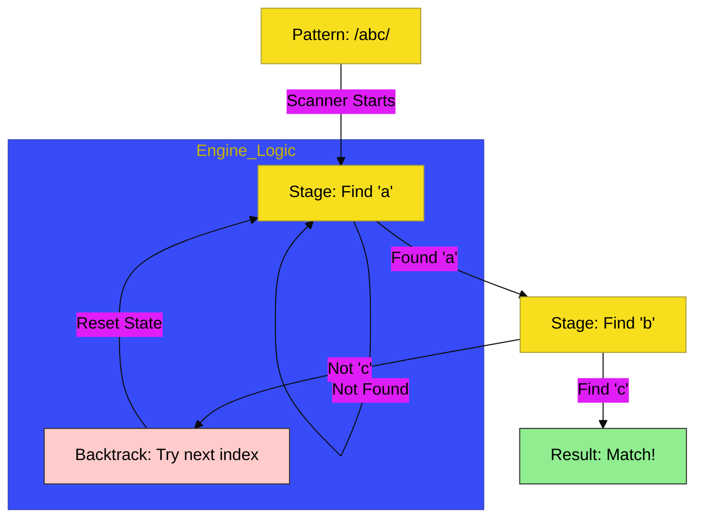

# CH-01: The Pattern Scanner

> **"Mesin Pemindai: Membedah Mekanisme State Machine dan Alur Pencocokan Teks Atomik."**

---

## 🔗 Source Hub
- **Primary Source**: [MDN Web Docs - Regular expressions](https://developer.mozilla.org/en-US/docs/Web/JavaScript/Guide/Regular_Expressions)
- **Technical Reference**: [ECMA-262 - RegExp Objects](https://tc39.es/ecma262/#sec-regexp-objects)
- **Conceptual Parent**: [BK-01 Pattern Matching](../README.md)

---

## 🌓 1. Essence: The Logic
Mencari pola di dalam teks masif bukan sekadar pencarian mentah. **Regular Expressions** (Regex) di **CH-01** membedah bagaimana JavaScript bertindak sebagai **State Machine** yang memindai karakter satu per satu untuk menemukan kecocokan yang presisi.

Memahami **Pattern Scanner** memungkinkan Anda membangun Hub aplikasi yang mampu memvalidasi input, mengekstrak data atomik, dan melakukan transformasi teks yang kompleks dengan efisiensi tinggi, berkat kemampuan mesin untuk mengingat status pencocokan secara internal.

---

## 🎨 2. Visual Logic: The State Machine Scanner Flow
Mekanisme pengolahan pola dan alur kerja pemindaian karakter:

---

## 🏛️ 3. Sections Atlas
- **[SEC-01: Regex Literals](./SEC-01_TheScanner/)**: Membedah teknik pembuatan pola menggunakan literal `/ /` dan konstruktor `RegExp`.
- **[SEC-02: Character Classes](./SEC-01_TheScanner/)**: Meninjau penggunaan kelas karakter dasar (`\d`, `\w`, `\s`) untuk pencocokan generik.
- **[SEC-03: Flags & Scopes](./SEC-01_TheScanner/)**: Menjelaskan atribut modifikasi (`g`, `i`, `m`) yang mengontrol cakupan pemindaian.

---

## 🧪 4. The Lab (Scanner Lab)
Uji ketajaman pemindaian pola dan mekanisme state machine di laboratorium:
- `../examples/regex_scanner_demo.js`

---

## ⚠️ 5. Common Pitfalls & Myths
- **Mitos**: *"Regex literal dan konstruktor RegExp bekerja identik."* (Faktanya, Regex literal dikompilasi saat skrip dimuat, sedangkan konstruktor dikompilasi saat runtime. Gunakan **RegExp Constructor** saat pola Anda bersifat dinamis berdasarkan masukan pengguna).
- **Mitos**: *"Flags global (`g`) akan mereset status secara otomatis."* (Sangat berbahaya; arsitek Hub harus waspada bahwa `g` flag menyimpan **`lastIndex`** secara internal. Jika tidak direset secara sadar, pencarian berikutnya akan dimulai dari posisi terakhir, bukan dari awal teks).

---
*Back to [Pattern Matching](../README.md)*
