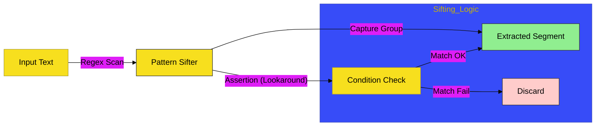

# CH-02: Advanced Logic

> **"Logika Penyaringan: Membedah Grup Penangkap dan Penegasan Lookaround."**

---

## 🔗 Source Hub
- **Primary Source**: [MDN Web Docs - Assertions](https://developer.mozilla.org/en-US/docs/Web/JavaScript/Guide/Regular_Expressions/Assertions)
- **Technical Reference**: [ECMA-262 - Groups and Backreferences](https://tc39.es/ecma262/#sec-groups-and-backreferences)
- **Conceptual Parent**: [BK-01 Pattern Matching](../README.md)

---

## 🌓 1. Essence: The Logic
Penyaringan data teks sering membutuhkan kriteria di luar pencocokan literal. Di **CH-02**, kita membedah mekanisme internal **Capture Groups** `(...)` untuk mengekstrak segmen data atomik dan **Lookaround Assertions** `(?=...)` untuk melakukan pengecekan kondisi tanpa memakan karakter pemindaian.

Memahami **Advanced Logic** ini memungkinkan Anda membangun Hub aplikasi yang mampu melakukan ekstraksi data bersyarat (seperti memvalidasi format password yang kompleks) dengan tingkat presisi yang sangat tinggi, tanpa perlu penulisan kode imperatif yang panjang.

---

## 🎨 2. Visual Logic: The Pattern Sifting Flow
Mekanisme pemisahan dan penyaringan data teks berdasarkan kriteria kompleks:

---

## 🏛️ 3. Sections Atlas
- **[SEC-01: Groups & Backreferences](./CH-02_AdvancedSifting/)**: Membedah teknik pengkapuran segmen data (`(...)`, `\1`) dan referensi balik.
- **[SEC-02: Lookaround Assertions](./CH-02_AdvancedSifting/)**: Meninjau pemindaian bersyarat (Lookahead/Lookbehind) tanpa konsumsi karakter.
- **[SEC-03: Quantifiers Pulse](./CH-02_AdvancedSifting/)**: Menjelaskan frekuensi pencocokan (`+`, `*`, `?`, `{n,m}`) secara kinetik.

---

## 🧪 4. The Lab (Logic Lab)
Uji ketajaman ekstraksi data bersyarat dan penyaringan grup di laboratorium:
- `../examples/regex_logic_demo.js`

---

## ⚠️ 5. Common Pitfalls & Myths
- **Mitos**: *"Lakukan lookup manual setelah pencarian regex."* (Salah, gunakan **Capture Groups** untuk mengekstrak data atomik langsung dari hasil pencocokan pertama, menghemat energi siklus aplikasi).
- **Mitos**: *"Assertions mengonsumsi teks pindaian."* (Faktanya, **Lookahead** dan **Lookbehind** bersifat non-konsumtif; mereka hanya memastikan kondisi ada atau tidak, lalu mesin akan melanjutkan pemindaian dari posisi yang sama, bukan dari akhir kondisi tersebut).

---
*Back to [Pattern Matching](../README.md)*
