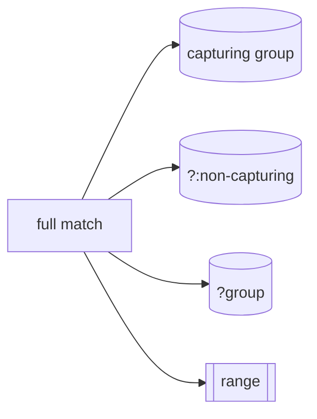

# SEC-02: Groups & Ranges (The Modular Sorters)

> **"Beberapa tanda tangan data memiliki struktur berlapis, seperti nama unit yang diikuti kode wilayah. Groups & Ranges adalah 'Pemilah Modular' (Modular Sorters) yang memungkinkan scanner memilah dan mengambil bagian spesifik dari sebuah temuan utuh ke dalam modul-modul yang bisa digunakan kembali."**

**Groups** dan **Ranges** memberikan kontrol granulasi pada RegExp. Mereka memungkinkan kita tidak hanya menemukan pola, tetapi juga mengidentifikasi sub-struktur di dalamnya untuk ekstraksi data yang lebih cerdas.

## Source Hub
- [MDN Web Docs - Groups and backreferences](https://developer.mozilla.org/en-US/docs/Web/JavaScript/Guide/Regular_expressions/Groups_and_backreferences)
- [MDN Web Docs - Character classes](https://developer.mozilla.org/en-US/docs/Web/JavaScript/Guide/Regular_expressions/Character_classes)

---

## 1. Mental Model: "The Modular Sorters"

Bayangkan Anda memindai sebuah paket data besar di Hub.
- **Capturing Groups `( ... )`**: Seperti kotak penyimpanan otomatis. Saat scanner menemukan kecocokan, ia akan menyalin bagian di dalam kurung ke dalam kotak bernomor agar Anda bisa mengambilnya nanti.
- **Non-Capturing Groups `(?: ... )`**: Seperti pengelompokan sementara untuk tujuan logika tanpa perlu menyimpan hasilnya ke kotak memori.
- **Named Groups `(?<label> ... )`**: Model kotak penyimpanan modern yang memakai label nama, bukan sekadar nomor urut.
- **Ranges `[ ... ]`**: Saringan grid yang menentukan karakter mana saja yang diizinkan masuk ke sensor, misalnya `a-z` atau `0-9`.




---

## 2. Teknik Pengelompokan

### A. Capturing & Backreferences
Setiap kurung `()` menyimpan hasilnya. Anda bisa memanggilnya kembali di dalam pola yang sama menggunakan **Backreference**.

```javascript
const duplicateScanner = /(\w+) \1/; // "energy energy"
```

### B. Named Capture Groups (ES2018+)
Sangat disarankan saat Anda ingin hasil ekstraksi lebih mudah dibaca.

```javascript
const dateScanner = /(?<year>\d{4})-(?<month>\d{2})-(?<day>\d{2})/;
const result = dateScanner.exec("2024-03-21");
console.log(result.groups.year); // "2024"
```

### C. Alternation `|`
Memungkinkan scanner memilih salah satu dari beberapa kemungkinan pola.

```javascript
const statusScanner = /online|offline|error/i;
```

---

## Arsitek Mindset: Ekstraksi Terorganisir

Sebagai arsitek Hub:
- **Use Named Groups**: Berikan label pada group Anda agar hasil ekstraksi terasa lebih jelas.
- **Use Non-Capturing Intentionally**: Gunakan `(?:...)` jika Anda hanya butuh pengelompokan logika.
- **Keep Ranges Compact**: Gunakan rentang `[a-z0-9]` daripada menulis karakter satu per satu.

---

## Hands-on: Lab Pemilahan Modular
Bedah string kompleks menjadi bagian-bagian yang terorganisir menggunakan teknik grouping di `examples/signature_sort_lab.js`.

---
*Status: [status.md](../../../status.md)*
