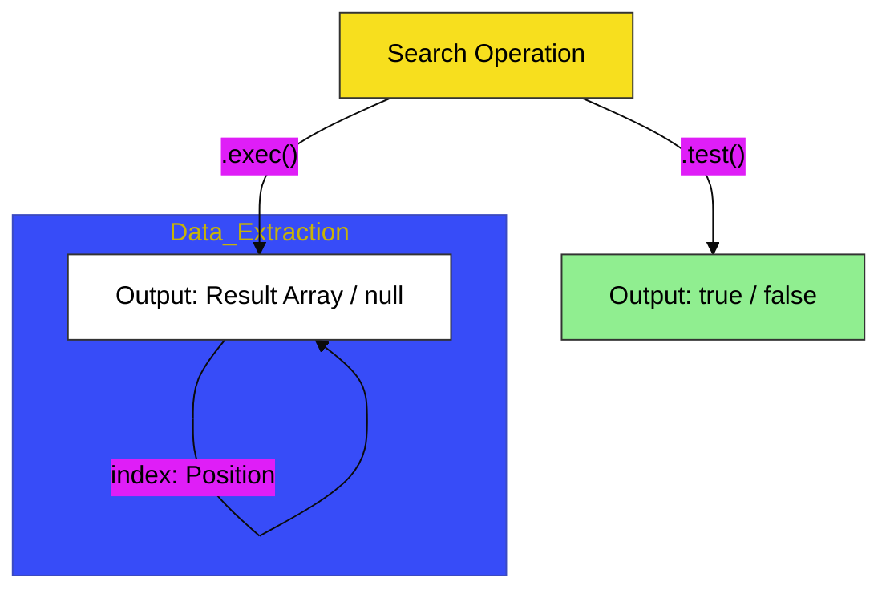

# CH-03: Operational Testing

> **"Operasi Pola: Menguji Keberadaan dan Mengekstrak Detail dari Medan Teks."**

---

## 🔗 Source Hub
- **Primary Source**: [MDN Web Docs - RegExp.prototype.test()](https://developer.mozilla.org/en-US/docs/Web/JavaScript/Reference/Global_Objects/RegExp/test)
- **Technical Reference**: [ECMA-262 - RegExp.prototype.exec](https://tc39.es/ecma262/#sec-regexp.prototype.exec)
- **Conceptual Parent**: [BK-01 Pattern Matching](../README.md)

---

## 🌓 1. Essence: The Logic
Memiliki pola hanyalah langkah pertama; menjalankannya adalah Inti Operasi. Di **CH-03**, kita membedah mekanisme internal penggunaan **`.test()`** untuk pemeriksaan biner (Keberadaan) dan **`.exec()`** untuk ekstraksi data mendalam (Lokasi & Tangkapan).

Memahami kontras operasional ini memungkinkan Anda membangun Hub aplikasi yang efisien: gunakan pemeriksaan biner yang ringan untuk validasi cepat, dan lakukan operasi ekstraksi yang lebih berat hanya saat Anda benar-benar membutuhkan data atomik di dalamnya.

---

## 🎨 2. Visual Logic: The Operational Result Logic
Mekanisme keluaran data berdasarkan metode operasi yang digunakan:

---

## 🏛️ 3. Sections Atlas
- **[SEC-01: Logical Testing](./CH-03_OperationalTesting/)**: Membedah teknik pemeriksaan cepat keberadaan pola menggunakan `.test()`.
- **[SEC-02: Executing Detail](./CH-03_OperationalTesting/)**: Meninjau pemecahan detail data melalui `.exec()` dan format kembalian array-nya.
- **[SEC-03: Global Loop](./CH-03_OperationalTesting/)**: Menjelaskan teknik perulangan eksekusi untuk menemukan seluruh kecocokan di dalam teks masif.

---

## 🧪 4. The Lab (Operational Lab)
Uji ketajaman pemeriksaan biner dan ekstraksi detail di laboratorium:
- `../examples/regex_operation_demo.js`

---

## ⚠️ 5. Common Pitfalls & Myths
- **Mitos**: *"Metode `.exec()` sama dengan `.match()`."* (Faktanya, `.exec()` adalah metode **RegExp**, sedangkan `.match()` adalah metode **String**. `exec` memberikan kontrol yang lebih granular dan berinteraksi langsung dengan status `lastIndex` objek regex Anda).
- **Mitos**: *"Lakukan `.test()` berulang kali pada regex global tanpa reset."* (Sangat berbahaya; jika flag **Global** (`g`) aktif, `test` akan terus memajukan posisi pencarian secara internal. Anda mungkin mendapatkan hasil `false` untuk teks yang sama hanya karena posisi pencarian sudah berada di akhir teks).

---
*Back to [Pattern Matching](../README.md)*
