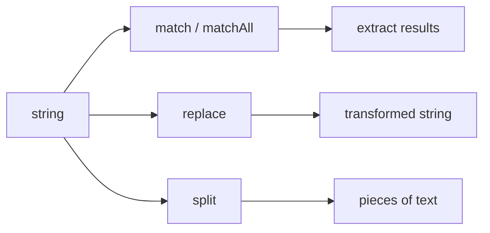

# SEC-02: String Methods (The Data Modifiers)

> **"Pemindaian data hanyalah separuh jalan. Hub seringkali perlu melakukan pembersihan, penggantian, atau ekstraksi massal. String Methods adalah 'Modifikator Data' (Data Modifiers) yang menggunakan cetakan pola RegExp Anda untuk mengubah bentuk data secara otomatis dan presisi."**

Metode yang menempel pada objek String (seperti `match`, `replace`, `split`) adalah konsumen utama dari pola RegExp Anda. Mereka menggunakan scanner tersebut untuk mencari, membagi, atau mengubah isi string asli.

## Source Hub
- [MDN Web Docs - String.prototype.match()](https://developer.mozilla.org/en-US/docs/Web/JavaScript/Reference/Global_Objects/String/match)
- [MDN Web Docs - String.prototype.matchAll()](https://developer.mozilla.org/en-US/docs/Web/JavaScript/Reference/Global_Objects/String/matchAll)
- [MDN Web Docs - String.prototype.replace()](https://developer.mozilla.org/en-US/docs/Web/JavaScript/Reference/Global_Objects/String/replace)
- [MDN Web Docs - String.prototype.split()](https://developer.mozilla.org/en-US/docs/Web/JavaScript/Reference/Global_Objects/String/split)

---

## 1. Mental Model: "The Data Modifiers"

Bayangkan data mengalir masuk ke stasiun pemrosesan Hub:
- **`.match()`**: Stasiun Penangkapan. Ia mengambil semua data yang ditandai scanner.
- **`.matchAll()`**: Stasiun Bio-Sken. Mirip `.match()` tapi memberikan detail forensik lengkap (Capture Groups) untuk setiap temuan dalam bentuk Iterator.
- **`.replace()`**: Stasiun Transformasi. Ia mencopot komponen lama dan memasang komponen baru sesuai pola.
- **`.split()`**: Stasiun Pemecah. Ia memotong aliran data menjadi potongan-potongan kecil berdasarkan pembatas pola.




---

## 2. Operasi Transformasi (.replace)

`.replace()` adalah salah satu metode terkuat karena ia mendukung penggantian dinamis:
1. **Backreferences**: Gunakan `$1`, `$2` di dalam string pengganti untuk memasukkan isi dari Capturing Groups.
2. **Callback Function**: Gunakan fungsi untuk menentukan hasil penggantian secara cerdas (misal: mengubah teks menjadi huruf besar atau melakukan kalkulasi).

```javascript
/* Contoh Mengubah Format Tanggal */
"2024-03-21".replace(/(\d{4})-(\d{2})-(\d{2})/, "$3/$2/$1"); // "21/03/2024"
```

---

## 3. Ekstraksi Massal Modern (.matchAll)

Diperkenalkan di ES2020, `.matchAll()` adalah cara terbaik untuk memproses banyak temuan yang mengandung Capturing Groups. Karena ia mengembalikan **Iterator**, ia sangat hemat memori saat memproses dokumen log yang sangat besar.

---

## Arsitek Mindset: Transformasi Aman

Sebagai arsitek Hub:
- **Avoid Global Ambiguity**: Saat menggunakan `.replace()`, pastikan RegExp Anda memiliki flag `g` jika ingin mengganti semua temuan. Jika tidak, hanya temuan pertama yang akan diproses (gunakan `.replaceAll()` untuk keamanan ekstra pada string).
- **Complex Split**: Gunakan `.split()` dengan RegExp jika pemisah data Anda tidak konsisten (misal: data dipisahkan oleh campuran koma, spasi, dan titik koma).
- **Callback Power**: Manfaatkan fungsi callback pada `.replace()` untuk melakukan "Dynamic Masking" pada data sensitif (seperti menyamarkan ID user kecuali 3 digit terakhir).

---

## Hands-on: Lab Modifikator Data
Berlatih mengubah format log Grid dan menyamarkan data rahasia menggunakan kekuatan String methods di `examples/sifting_methods_lab.js`.

---
*Status: [status.md](../../../status.md)*
