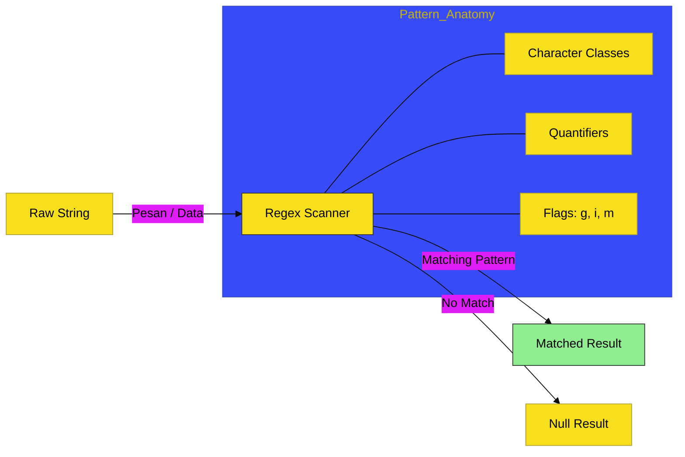

# SR-09: Regular Expressions

> **"Sistem Pemindai Pola: Menemukan Bentuk di Balik Deretan String."**

---

## 🔗 Source Hub
- **Primary Source**: [MDN Web Docs - Regular Expressions](https://developer.mozilla.org/en-US/docs/Web/JavaScript/Guide/Regular_Expressions)
- **Technical Reference**: [ECMA-262 - RegExp Objects](https://tc39.es/ecma262/#sec-regexp-objects)
- **Conceptual Parent**: [RAK-02 Foundation](../README.md)

---

## 🌓 1. Essence: The Narrative
Dalam arus data tekstual yang raksasa, kita membutuhkan alat presisi untuk mengenali pola. **Regular Expressions** (Regex) di JavaScript adalah bahasa pola ringkas untuk memindai, mencari, mengekstrak, dan mengganti isi teks yang sesuai dengan kriteria tertentu secara instan.

Penguasaan SR-09 adalah tentang **Disiplin Pemindaian**. Memahami kapan regex adalah alat yang tepat dan bagaimana menyusun pola yang efisien tanpa membuat kode menjadi teka-teki yang sulit dibaca (*Readability Balance*).

---

## 🗺️ 2. Landscape: The Big Picture
Sub-Rak ini memfokuskan dekonstruksi pola melalui satu buku operasional utama:

### 🎨 Visual Logic: The Pattern Scanner Flow

### 🏛️ Books Atlas
1.  **[BK-01: Pattern Matching](./BK-01_PatternMatching/)**: Membahas dasar-dasar scanner regex (literal/constructor), asersi, grup, dan bagaimana metode string berinteraksi dengan scanner pola.

---

## 🧪 3. The Lab (Pattern Lab)
Masuk ke setiap Bab untuk melihat bagaimana scanner pola digunakan dari validasi input sederhana sampai ekstraksi informasi kompleks di dalam Hub.

---

## ⚠️ 4. Common Pitfalls & Myths
- **Mitos**: *"Semakin rumit regex, semakin hebat developernya."* (Salah, regex yang terlalu rumit seringkali mustahil untuk di-debug; gunakan regex dengan bijak dan dokumentasikan polanya).
- **Mitos**: *"Regex lambat."* (Faktanya, Regex di JavaScript sangat dioptimasi; namun pola yang buruk bisa menyebabkan **ReDoS** (*Regular Expression Denial of Service*) yang akan memakan CPU sirkuit aplikasi Anda).

---
*Status: [x] Complete. Struktur dan Visual telah diselaraskan ke Adaptive Gold Standard.*
