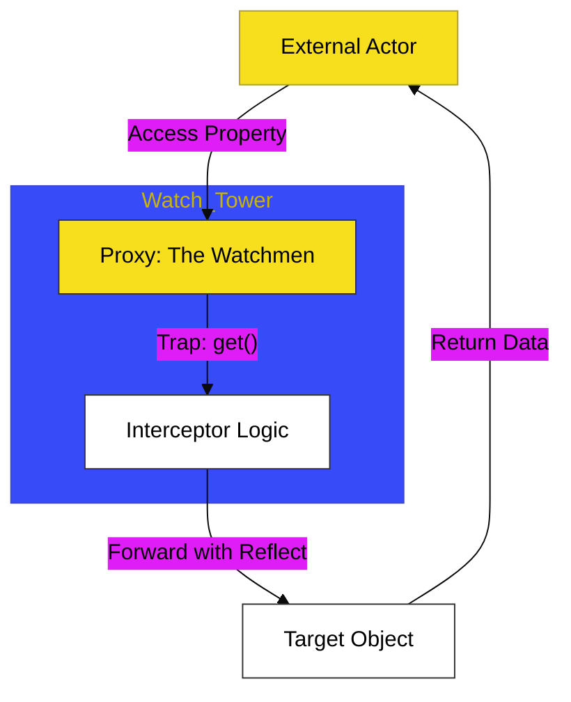

# CH-01: The Watchmen

> **"Sang Penjaga: Mencegat dan Mengendalikan Alur Interaksi Objek Melalui Metaprogramming."**

---

## 🔗 Source Hub
- **Primary Source**: [MDN Web Docs - Proxy](https://developer.mozilla.org/en-US/docs/Web/JavaScript/Reference/Global_Objects/Proxy)
- **Technical Reference**: [ECMA-262 - Proxy Objects](https://tc39.es/ecma262/#sec-proxy-objects)
- **Conceptual Parent**: [BK-01 Meta Programming](../README.md)

---

## 🌓 1. Essence: The Logic
Dalam arsitektur tingkat tinggi, kita sering membutuhkan kontrol penuh atas apa yang terjadi saat sebuah objek diakses atau dimodifikasi. **Proxy** di **CH-01** membedah mekanisme internal penciptaan "Penjaga" atau **Watchmen** yang berdiri di depan objek target. Dengan menggunakan **Traps**, kita bisa mencegat tindakan seperti pembacaan, penulisan, atau pemanggilan fungsi.

Memahami **Metaprogramming** ini memungkinkan Anda membangun fitur Hub yang canggih, mulai dari *Data Binding* otomatis, validasi skema runtime, hingga logging akses data secara kinetik dan terisolasi.

---

## 🎨 2. Visual Logic: The Interceptor Trap
Mekanisme pencegatan interaksi antara aktor luar dan objek target:

---

## 🏛️ 3. Sections Atlas
- **[SEC-01: Proxy Foundations](./CH-01_TheWatchmen/)**: Membedah teknik pembungkusan objek target dan pendefinisian handler.
- **[SEC-02: Reflect API](./CH-01_TheWatchmen/)**: Meninjau pasangan statis Proxy untuk meneruskan interaksi secara default dengan aman.
- **[SEC-03: Practical Traps](./CH-01_TheWatchmen/)**: Menjelaskan penggunaan trap populer (`get`, `set`, `has`, `deleteProperty`) dalam skenario nyata.

---

## 🧪 4. The Lab (Watchmen Lab)
Uji ketajaman pencegatan dan pengendalian objek di laboratorium:
- `../examples/proxy_watchmen_demo.js`

---

## ⚠️ 5. Common Pitfalls & Myths
- **Mitos**: *"Proxy memperlambat aplikasi secara signifikan."* (Faktanya, meskipun ada biaya overhead kecil karena adanya lapisan pencegatan, optimasi engine JavaScript modern membuatnya sangat layak digunakan untuk arsitektur *Logic-Heavy* seperti sistem reaktivitas framework).
- **Mitos**: *"Lakukan operasi langsung pada target di dalam trap."* (Sangat berbahaya; arsitek Hub harus menggunakan **`Reflect`** untuk meneruskan operasi ke target guna memastikan perilaku internal objek (seperti `this` binding) tetap terjaga sesuai standar spesifikasi).

---
*Back to [Meta Programming](../README.md)*
