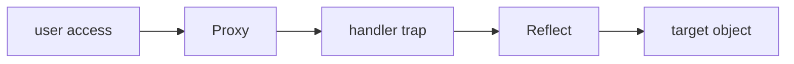

# SEC-01: Proxy Basics (The Watchmen)

> **"Di dalam Hub, tidak semua akses ke unit data harus dibiarkan tanpa pengawasan. Proxy adalah 'Penjaga' (The Watchman) yang berdiri di depan objek asli, mencegat setiap permintaan akses (get, set) untuk melakukan validasi, logging, atau modifikasi data secara real-time sebelum diteruskan ke tujuan aslinya melalui protokol Reflect."**

**Proxy** dan **Reflect** adalah fondasi dari *Meta-programming* di JavaScript. Mereka memungkinkan kita untuk mendefinisikan perilaku kustom bagi operasi dasar pada objek (seperti pembacaan properti atau pemanggilan fungsi).

## Source Hub
- [MDN Web Docs - Proxy](https://developer.mozilla.org/en-US/docs/Web/JavaScript/Reference/Global_Objects/Proxy)
- [MDN Web Docs - Meta programming](https://developer.mozilla.org/en-US/docs/Web/JavaScript/Guide/Meta_programming)

---

## 1. Mental Model: "The Watchmen"

Bayangkan seorang penjaga pintu (Proxy) yang berdiri di depan brankas data (Target Object).
- **The Proxy (The Watchman)**: Setiap kali seseorang ingin berinteraksi dengan brankas (misal: mengambil data), mereka harus melewati penjaga ini. Penjaga memiliki daftar aturan (**Handler**) untuk memutuskan apa yang harus dilakukan.
- **The Reflect (The Official Record)**: Jika penjaga mengizinkan akses, ia menggunakan alat pembuka brankas resmi (**Reflect**) untuk mengambil data dengan cara yang benar dan terstandarisasi, lalu menyerahkannya kembali ke pengguna.




---

## 2. Struktur Meta-Operasi

Sistem ini terdiri dari tiga bagian:
1.  **Target**: Objek asli yang ingin diproteksi/dimodifikasi.
2.  **Handler**: Objek berisi "Traps" (perangkap) yang mendefinisikan operasi apa yang ingin dicegat (misal: `get`, `set`, `has`).
3.  **Reflect**: Objek statis yang menyediakan metode untuk melakukan operasi objek asli dengan aman di dalam trap.

```javascript
/* Skema Dasar */
const proxy = new Proxy(target, {
    get(obj, prop, receiver) {
        // Intersepsi pembacaan
        return Reflect.get(obj, prop, receiver);
    }
});
```

---

## 3. Traps Paling Berpengaruh

- **`get(target, prop)`**: Dicegat saat properti dibaca. Berguna untuk nilai default atau logging.
- **`set(target, prop, value)`**: Dicegat saat properti diubah. Berguna untuk validasi tipe data.
- **`has(target, prop)`**: Dicegat saat operator `in` digunakan. Bisa digunakan untuk menyembunyikan properti rahasia.

---

## Arsitek Mindset: Pengawasan Tanpa Gangguan

Sebagai arsitek Hub:
- **Decoupled Logic**: Gunakan Proxy untuk menambahkan fitur (seperti sinkronisasi data ke server) tanpa harus menyentuh logika di dalam objek data asli.
- **Performance Budget**: Ingat bahwa setiap interaksi sekarang melewati lapisan tambahan. Jangan gunakan Proxy untuk operasi yang sangat intensif di dalam loop mikro yang kritis.
- **Security Guard**: Gunakan Proxy untuk menciptakan objek "Read-Only" yang tidak bisa ditembus oleh skrip pihak ketiga di dalam Hub.

---

## Hands-on: Lab Sang Interseptor
Eksperimen dengan pembuatan sistem proteksi otomatis dan validasi data real-time di `examples/proxy_validator_lab.js`.

---
*Status: [status.md](../../../status.md)*
