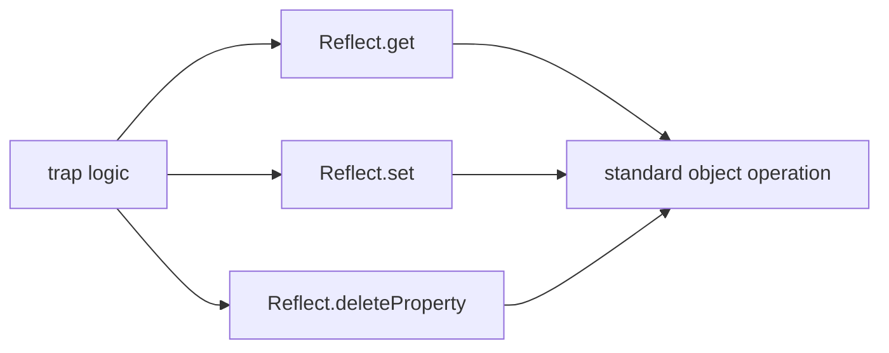

# SEC-02: Reflect API (The Official Record)

> **"Jika Proxy adalah penjaga yang mencegat permintaan, maka Reflect adalah 'Catatan Resmi' (The Official Record) yang menyediakan cara standar dan aman untuk melakukan operasi pada objek tanpa merusak alur internal sistem Hub."**

**Reflect** adalah objek statis built-in yang menyediakan metode untuk mengoperasikan objek dengan cara yang lebih teratur, fungsional, dan dapat diprediksi. Setiap trap pada Proxy memiliki metode yang sesuai di dalam Reflect.

## Source Hub
- [MDN Web Docs - Reflect](https://developer.mozilla.org/en-US/docs/Web/JavaScript/Reference/Global_Objects/Reflect)
- [MDN Web Docs - Proxy](https://developer.mozilla.org/en-US/docs/Web/JavaScript/Reference/Global_Objects/Proxy)

---

## 1. Mental Model: "The Official Record"

Bayangkan Proxy sebagai filter atau penjaga. Setelah filter menyetujui sebuah permintaan, ia harus meneruskannya ke objek asli.
- **Direct Access (`obj[prop] = value`)**: Pendekatan langsung ini bisa terasa cepat, tetapi dalam kasus tertentu hasil gagalnya tidak selalu sejelas yang kita inginkan.
- **Reflect Access (`Reflect.set(...)`)**: Seperti menggunakan kunci resmi dari Hub. Operasi dilakukan dengan protokol yang lebih konsisten dan memberi laporan status yang eksplisit.




---

## 2. Keunggulan Protokol Reflect

| Fitur | Pendekatan Objek/Operator | Pendekatan Reflect | Manfaat |
| :--- | :--- | :--- | :--- |
| **Nilai Balik** | `delete obj.p` | `Reflect.deleteProperty(obj, 'p')` | Mengembalikan Boolean (`true/false`) |
| **Konteks `this`** | Manual binding | Parameter `receiver` | Menjaga pewarisan tetap akurat |
| **Error Handling** | `Object.defineProperty` | `Reflect.defineProperty` | Lebih mudah dipakai dalam alur yang eksplisit |
| **Fungsional** | `(x in obj)` | `Reflect.has(obj, x)` | Cocok untuk gaya utilitas berbasis fungsi |

---

## 3. Sinergi dengan Proxy: Parameter `receiver`

Salah satu alasan terkuat menggunakan `Reflect` di dalam Proxy adalah parameter `receiver`. Parameter ini membantu menjaga konteks `this` tetap merujuk ke objek akhir yang benar saat ada pewarisan.

```javascript
const handler = {
    get(target, prop, receiver) {
        return Reflect.get(target, prop, receiver);
    }
};
```

---

## Arsitek Mindset: Standarisasi Operasi

Sebagai arsitek Hub:
- **Consistency First**: Gunakan `Reflect` di dalam Proxy trap agar alur intersepsi tetap rapi.
- **Functional Style**: `Reflect` berguna saat Anda ingin operasi objek terasa lebih seperti pemanggilan fungsi biasa.
- **Safe Definition**: Ia membantu membuat niat operasi lebih eksplisit daripada operator atau akses manual tersebar.

---

## Hands-on: Lab Protokol Cermin
Sempurnakan cara kerja Proxy Anda dan pelajari perbedaan praktis antara `Object` dan `Reflect` di `examples/reflect_mirror_lab.js`.

---
*Status: [status.md](../../../status.md)*
