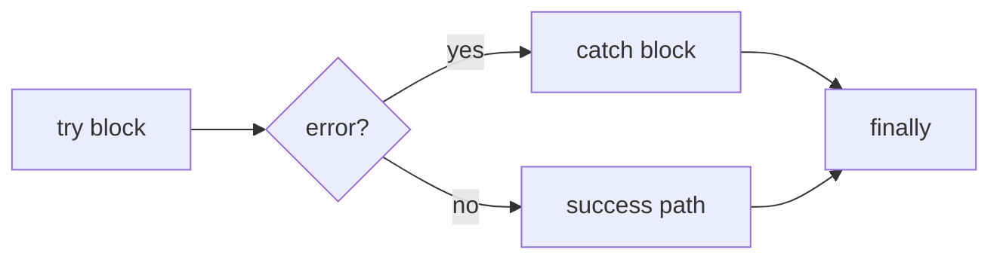

# SEC-01: Advanced Errors (The Nested Fuses)

> **"Kabel terbakar? Kebocoran energi? Di Grid yang kompleks, kegagalan adalah kepastian. Advanced Errors adalah 'Sekring Berlapis' (The Nested Fuses) yang memastikan ketika satu komponen meledak, ledakannya terisolasi dan tidak merambat ke seluruh Hub, sambil tetap menyimpan rekam jejak kegagalannya."**

**Error Handling** tingkat lanjut di JavaScript tidak hanya tentang menangkap kesalahan, tetapi juga tentang klasifikasi, pelacakan penyebab (*Error Chaining*), dan pembersihan sumber daya yang aman.

## Source Hub
- [MDN Web Docs - Error](https://developer.mozilla.org/en-US/docs/Web/JavaScript/Reference/Global_Objects/Error)
- [MDN Web Docs - try...catch](https://developer.mozilla.org/en-US/docs/Web/JavaScript/Reference/Statements/try...catch)

---

## 1. Mental Model: "The Nested Fuses"

Setiap operasi kritis di dalam Hub dilindungi oleh sistem sekring:
- **`try` (The Chamber)**: Ruangan tempat eksperimen atau operasi data dijalankan.
- **`catch` (The Automatic Fuse)**: Saklar darurat yang aktif seketika jika terjadi "percikan api" (Error). Ia menangkap objek kegagalan untuk dianalisis.
- **`finally` (The Recovery Team)**: Tim pembersih yang WAJIB datang setelah operasi selesai, baik meledak maupun sukses, untuk melepaskan beban energi atau menutup katup data.
- **`cause` (The Lineage)**: Rekam jejak yang menghubungkan satu ledakan ke ledakan lainnya untuk mengetahui akar masalah sebenarnya.




---

## 2. Fitur Keamanan Modern

### A. Error Chaining (ES2022)
Gunakan properti `cause` saat melempar kembali error untuk melampirkan error asli sebagai penyebab. Ini menjaga *stack trace* tetap utuh.
```javascript
try {
    processData();
} catch (err) {
    throw new Error("Gagal memproses data di Sektor 7", { cause: err });
}
```

### B. Custom Error Classes
Membangun hierarki kegagalan khusus agar Hub bisa membedakan antara "Kesalahan Input" (Minor) dan "Kerusakan Reaktor" (Kritis).

```javascript
class CriticalSystemError extends Error {
    constructor(message, options) {
        super(message, options);
        this.name = "CriticalSystemError";
        this.automatedAlert = true;
    }
}
```

---

## 3. Protokol Pembersihan (finally)
Apapun yang terjadi di dalam `try`, blok `finally` akan dieksekusi. Ini adalah tempat yang paling aman untuk:
- Menutup koneksi database.
- Menghapus timer/interval.
- Mengubah status "Loading" menjadi "Idle".

---

## Arsitek Mindset: Ketahanan Berlapis

Sebagai arsitek Hub:
- **Never Swallow Errors**: Jangan pernah menggunakan `catch` kosong. Minimal, kirimkan log ke sistem pemantauan Hub.
- **Preserve the Cause**: Selalu lampirkan error asli menggunakan `{ cause: err }` agar teknisi di masa depan tahu persis di mana kabel pertama kali terbakar.
- **Classification Matters**: Gunakan `instanceof` untuk menangani berbagai tipe error dengan cara yang berbeda di satu blok `catch`.

---

## Hands-on: Lab Protokol Darurat
Bangun sistem keamanan yang berlapis dan lacak akar masalah menggunakan teknik error chaining di `examples/emergency_protocols_lab.js`.

---
*Status: [status.md](../../../status.md)*
