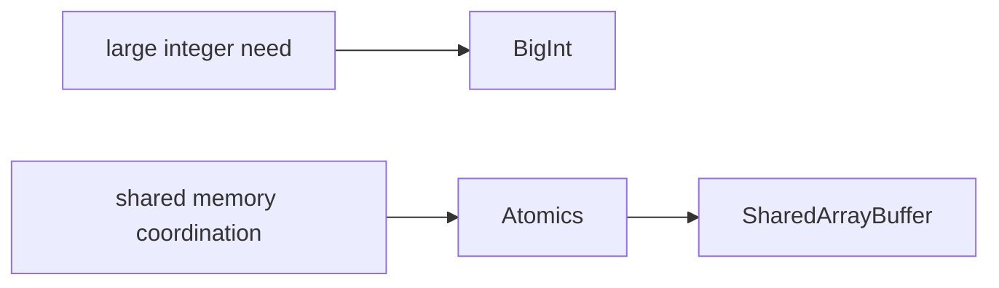

# SEC-01: BigInt & Atomics (The High-Precision Gauges)

> **"Beberapa beban kerja di Hub melampaui angka standar atau membutuhkan koordinasi sinkronisasi yang sangat ketat antar pekerja Grid. BigInt & Atomics adalah 'Meteran Presisi Tinggi' (High-Precision Gauges) untuk menangani dua kebutuhan ekstrem itu."**

JavaScript modern menyediakan dua instrumen khusus: `BigInt` untuk integer sangat besar, dan `Atomics` untuk keamanan operasi pada memori bersama di lingkungan multi-thread.

## Source Hub
- [MDN Web Docs - BigInt](https://developer.mozilla.org/en-US/docs/Web/JavaScript/Reference/Global_Objects/BigInt)
- [MDN Web Docs - Atomics](https://developer.mozilla.org/en-US/docs/Web/JavaScript/Reference/Global_Objects/Atomics)
- [MDN Web Docs - SharedArrayBuffer](https://developer.mozilla.org/en-US/docs/Web/JavaScript/Reference/Global_Objects/SharedArrayBuffer)

---

## 1. Mental Model: "The High-Precision Gauges"

Bayangkan dua alat ukur canggih di ruang kontrol Hub:
- **BigInt**: Timbangan raksasa yang tidak terikat batas aman `Number`.
- **Atomics**: Pengatur lalu lintas memori bersama agar banyak pekerja tidak saling merusak data.




---

## 2. Protokol Instrumen

### A. BigInt: Melewati Batas Aman
Gunakan akhiran `n` untuk mendefinisikan BigInt. Ingat: BigInt tidak bisa dicampur dengan `Number` biasa tanpa konversi.

```javascript
const maxSafe = BigInt(Number.MAX_SAFE_INTEGER);
const hugeValue = maxSafe + 2n;
```

### B. Atomics: Sinkronisasi Tanpa Celah
Atomics bekerja di atas typed array yang menggunakan `SharedArrayBuffer`.

```javascript
Atomics.add(typedArray, 0, 1);
```

---

## 3. Fitur Utama Atomics
- **`load` / `store`**: Membaca dan menulis data dengan visibilitas antar thread yang lebih aman.
- **`wait` / `notify`**: Mekanisme tidur dan bangun untuk koordinasi pekerja.
- **Atomic updates**: Operasi perubahan berjalan sebagai satu langkah yang tidak boleh terpotong.

---

## Arsitek Mindset: Akurasi vs Kompleksitas

Sebagai arsitek Hub:
- **Use BigInt Intentionally**: Pakai BigInt hanya saat batas `Number` benar-benar menjadi masalah.
- **Treat Atomics as Specialized**: Atomics bukan alat harian; ia relevan saat Anda benar-benar memakai memori bersama.
- **Keep Types Clear**: Jangan campur `BigInt` dan `Number` sembarangan, dan dokumentasikan asumsi tipe Anda dengan jelas.

---

## Hands-on: Lab Instrumen Presisi
Uji perhitungan angka raksasa dan simulasi koordinasi memori bersama di `examples/precision_tools_lab.js`.

---
*Status: [status.md](../../../status.md)*
