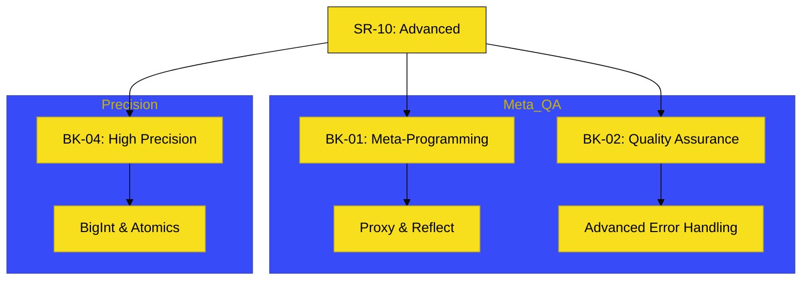

# SR-10: Advanced (The Specialized Systems)

> **"Toolkit Spesialis: Instrumen Tingkat Tinggi untuk Arsitektur Kompleks."**

---

## 🔗 Source Hub
- **Primary Source**: [MDN Web Docs - Advanced Topics](https://developer.mozilla.org/en-US/docs/Web/JavaScript/Reference)
- **Technical Reference**: [ECMA-262 - Meta-Programming](https://tc39.es/ecma262/#sec-reflection)
- **Conceptual Parent**: [RAK-02 Foundation](../README.md)

---

## 🌓 1. Essence: The Narrative
Setelah seluruh fondasi dikuasai, JavaScript masih menawarkan serangkaian sistem khusus untuk tantangan ekstrem. **SR-10** mengumpulkan instrumen spesialis ini—dari **Meta-Programming** (mengatur bagaimana kode berinteraksi dengan dirinya sendiri), hingga **High Precision** (menangani angka raksasa di luar batas standar).

Penguasaan SR-10 bukan tentang memakai semua fitur sekaligus, melainkan tentang mengetahui kapan harus menggunakan alat presisi tinggi ini untuk menjaga integritas sistem yang sangat besar atau sangat spesifik.

---

## 🗺️ 2. Landscape: The Big Picture
Sub-Rak ini membagi instrumen spesialis ke dalam 4 buku arsitektur:

### 🎨 Visual Logic: The Advanced Toolkit Map

### 🏛️ Books Atlas
1.  **[BK-01: MetaProgramming](./BK-01_MetaProgramming/)**: Menggunakan **Proxy** dan **Reflect** untuk mengintersepsi dan mengarahkan operasi dasar objek secara dinamis.
2.  **[BK-02: Quality Assurance](./BK-02_QualityAssurance/)**: Penanganan error tingkat lanjut dan sinkronisasi status aplikasi yang lebih tahan gangguan.
3.  **[BK-04: High Precision](./BK-04_HighPrecision/)**: Instrumen untuk angka ekstrem (**BigInt**) dan sinkronisasi memori bersama (**Atomics**).

---

## 🧪 3. The Lab (Advanced Lab)
Masuk ke setiap Bab untuk melihat bagaimana fitur lanjutan ini digunakan dalam membangun Proxy interseptor, sistem QA yang kuat, dan pemrosesan angka raksasa yang presisi.

---

## ⚠️ 4. Common Pitfalls & Myths
- **Mitos**: *"Fitur Advanced harus dipakai di setiap modul."* (Salah, instrumen di SR-10 adalah alat spesialis; gunakan hanya saat solusi standar tidak lagi mencukupi).
- **Mitos**: *"Proxy memperlambat eksekusi."* (Faktanya, ada overhead performa kecil, namun manfaat arsitekturalnya untuk abstraksi tingkat tinggi (seperti reactivity di framework) jauh lebih besar daripada biayanya).

---
*Status: [x] Complete. Struktur dan Visual telah diselaraskan ke Adaptive Gold Standard.*
