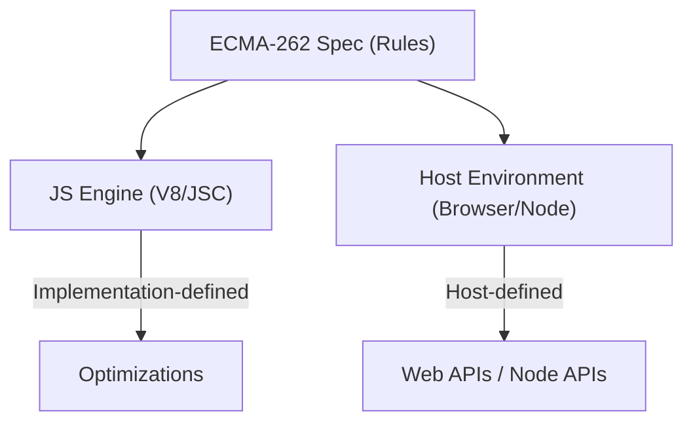
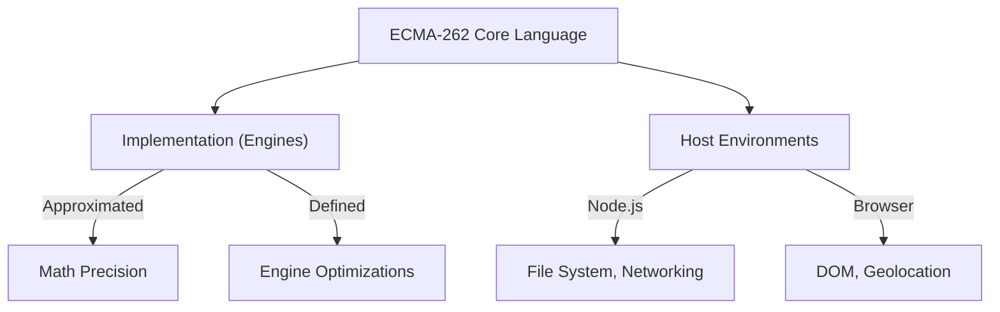

# CH-01: Overview & Implementation Context

*Pemetaan ECMA-262: Clause 4.4.1 - 4.4.3*

Selamat datang di jantung spesifikasi. Sebelum kita membedah objek dan variabel, kita harus paham bagaimana spesifikasi "berbicara" dengan dunia luar. ECMAScript tidak berdiri sendiri; ia butuh wadah untuk dijalankan.

## 🏗️ Runtime Context Topology

---

## 1. Implementation-approximated (Clause 4.4.1)
Beberapa fitur di JavaScript tidak memiliki hasil yang "pasti" secara matematis di semua mesin. Spesifikasi memberikan panduan perilaku ideal, namun mengakui keterbatasan perangkat keras.
- **Contoh**: Presisi pada perhitungan matematika kompleks (`Math.sin`, `Math.cos`). Mesin boleh melakukan pembulatan yang sedikit berbeda asalkan tetap dalam batas toleransi spek.

## 2. Implementation-defined (Clause 4.4.2)
Ini adalah fitur yang perilakunya diserahkan sepenuhnya kepada pembuat mesin JS (V8, JavaScriptCore, dll). Spek hanya mengatakan "Sesuatu harus terjadi", namun detailnya tidak diatur secara ketat.
- **Tujuan**: Memungkinkan optimasi performa yang berbeda-beda antar vendor mesin.

## 3. Host-defined (Clause 4.4.3)
Fitur atau perilaku yang ditentukan oleh **Lingkungan** (Host) tempat ECMAScript berjalan. Bagian ini biasanya menyentuh API di luar bahasa inti.
- **Node.js**: `fs`, `path`, `process`.
- **Browser**: `window`, `document`, `fetch`.

---

## Arsitek Mindset: Portability & Risks
Sebagai arsitek, pemahaman ini krusial untuk menjaga **Portable Code**. Kode yang terlalu bergantung pada *Host-defined* API akan sulit dijalankan di lingkungan lain. Selalu pisahkan logika inti bahasa (*Ecma-Core*) dari interaksi lingkungan (*Host Interaction*).

---

## Referensi Terkait
- [ECMA-262 Clause 4.4.1 - 4.4.3](https://tc39.es/ecma262/#sec-terminology-and-algorithms)
- [BK-01/CH-06: Standard vs Built-in Objects](../CH-06_StandardVsBuiltInObjects/README.md)

---
> [!IMPORTANT]
> Jangan pernah berasumsi bahwa fitur Host-defined akan berperilaku sama persis di setiap lingkungan. Selalu gunakan *feature detection* untuk menjaga kompatibilitas.
