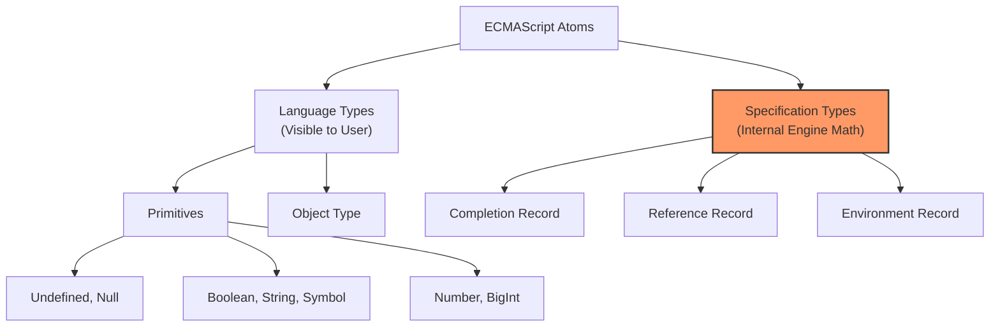

# CH-02: The Concept of Type (The Engine's Atoms)

*Source: [ECMA-262 Clause 6 - Data Types and Values](https://tc39.es/ecma262/#sec-ecmascript-data-types-and-values)*

## 1. Konsep Dasar

### 🏢 Logic-Pure (The Set Definition)
Dalam spesifikasi ECMA-262, sebuah **Type** didefinisikan secara formal sebagai **Himpunan Nilai (Set of Values)**. Secara operasional, mesin JavaScript menggunakan tipe untuk menentukan batasan data dan jalur eksekusi algoritma. Jika sebuah nilai `v` termasuk dalam himpunan `T`, maka `v` memiliki tipe `T`.

### 📚 Analogy-Model (The Stamp Album)
Bayangkan sebuah koleksi perangko raksasa. "Type" adalah album-album berbeda yang memiliki kriteria masuk yang ketat. 
- **Album Number**: Hanya menerima angka (termasuk ±0, Infinity, NaN).
- **Album Boolean**: Hanya menerima dua keping koin unik (`true` dan `false`).
- **Album Object**: Menerima kumpulan properti yang bisa berubah-ubah bentuknya.

---

## 2. Mekanisme Internal: Algoritma `Type(v)`

Setiap kali mesin JS bertemu nilai `v`, ia menjalankan operasi abstrak `Type(v)` (secara implisit) untuk memvalidasi aliran data.

**Langkah-langkah Evaluasi:**
1. Jika `v` tidak memiliki nilai (slot memori kosong/uninitialized), kembalikan **Undefined**.
2. Jika `v` merepresentasikan ketiadaan objek secara sengaja, kembalikan **Null**.
3. Jika `v` adalah entitas dengan internal slot `[[NumberData]]`, kembalikan **Number**.
4. Jika `v` adalah struktur kompleks dengan internal slots seperti `[[Prototype]]` dan `[[Extensible]]`, kembalikan **Object**.

---

## 3. State & Architecture Mapping

ECMAScript membagi dunia tipe menjadi dua kategori besar: **Language Types** (yang kita sentuh di kode) dan **Specification Types** (yang digunakan mesin untuk berpikir).

### A. ECMAScript Language Types
| Type | Deskripsi Internal | Contoh State |
| :--- | :--- | :--- |
| **Undefined** | Nilai tunggal `undefined`. | `[[Value]]: undefined` |
| **Null** | Nilai tunggal `null`. | `[[Value]]: null` |
| **Boolean** | Himpunan `{true, false}`. | `[[Value]]: true` |
| **String** | Urutan 16-bit integer (UTF-16). | `"JS"` |
| **Number** | 64-bit Binary (IEEE 754). | `42`, `NaN`, `+0` |
| **Object** | Koleksi Properti + Internal Slots. | `[[Prototype]]`, `[[Extensible]]` |

### B. Specification Types (The Ghost Types)
*Tipe-tipe ini tidak pernah muncul saat Anda memanggil `typeof`, tapi sangat vital bagi arsitektur:*
- **List & Record**: Digunakan untuk argumen algoritma.
- **Completion Record**: Menentukan alur kontrol (Normal vs Abrupt/Error).
- **Reference Record**: Mekanisme di balik navigasi variabel.

---

## 4. Visualisasi Hirarki (Mermaid)

---

## 5. Lab Praktis: Probing the Types

Pembuktian perilaku tipe melalui *Type Conversion* dan identifikasi internal dapat dilihat di [examples/](./examples/type_probing.js).

**Key Observation:**
`typeof null === "object"` adalah kesalahan sejarah (bug legacy), tetapi secara internal spec tetap mengakui `Null` sebagai tipe primodial yang unik, bukan bagian dari himpunan `Object`.

---

## 6. Hubungan Sistem (Cross-Rack)

Pemahaman tentang **Language Types** di sini (RAK-12) sangat krusial saat Anda mempelajari **Optimization Guards** di **RAK-14 (Engines)**. V8 menggunakan informasi tipe ini untuk membuat *Hidden Classes (Maps)* guna mengoptimalkan akses memori. Jika tipe data berubah-ubah (*Polymorphic*), performa sistem akan turun drastis di level Engine.
