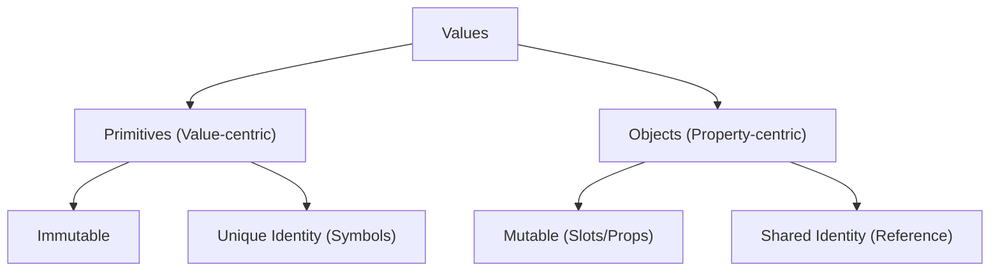

# CH-03: Primitive Values & Objects

*Pemetaan ECMA-262: Clause 6.1 (Data Types)*

Inilah pembagian kasta terbesar di JavaScript: **Primitive** vs **Object**. Memahami batas jelas antara keduanya adalah kunci untuk menguasai manajemen memori dan performa.

## Mental Model: "Kelereng vs Kotak Perkakas"
- **Primitive Value**: Ibarat sebutir kelereng. Padat, tidak bisa dibuka, dan jika Anda ingin mengubahnya, Anda harus membuang kelereng lama dan mengambil yang baru (**Immutable**).
- **Object**: Ibarat sebuah kotak perkakas. Anda bisa menambah obeng, membuang palu, atau mengganti isinya tanpa harus mengganti kotaknya (**Mutable**).

---

## 1. Primitive Type (Clause 6.1.1 - 6.1.6)
Nilai primitif adalah data yang direpresentasikan langsung pada level terendah dari implementasi bahasa. Karakteristik utamanya adalah:
- **Immutable**: Nilainya tidak bisa diubah. 
- **Passed by Value**: Saat di-copy, nilainya diduplikasi sepenuhnya.

| Type | Set of Values |
| :--- | :--- |
| **Undefined** | `{ undefined }` |
| **Null** | `{ null }` |
| **Boolean** | `{ true, false }` |
| **String** | Himpunan semua urutan 16-bit unsigned integer values. |
| **Number** | Himpunan nilai floating-point 64-bit (IEEE 754). |
| **BigInt** | Himpunan nilai integer dengan presisi arbitrer. |
| **Symbol** | Nilai unik dan non-string yang bisa digunakan sebagai kunci properti. |

## 🏗️ Primitive vs Object Topology



---
graph LR
    A["Object"] --> B["Properties (Key-Value)"]
    A --> C["Prototype (Reference)"]
    B --> B1["Data Properties"]
    B --> B2["Accessor Properties"]
```

## 3. Fenomena Autoboxing
Bagaimana bisa primitif seperti String punya method (misal: `"abc".toUpperCase()`)? 
Secara statis, spesifikasi menjelaskan ini melalui algoritma **ToObject**. JavaScript akan "membungkus" sementara primitif tersebut ke dalam objek padanannya agar propertinya bisa diakses, lalu segera membuang pembungkusnya.

---

## Arsitek Mindset: Memory Awareness
Gunakan primitif sesering mungkin untuk data sederhana karena jauh lebih hemat memori dan cepat diproses oleh engine. Gunakan objek hanya saat Anda butuh struktur data kompleks atau perilaku yang membutuhkan *state* dan *inheritance*.

---

## Referensi Terkait
- [ECMA-262 Clause 6.1 - ECMAScript Language Types](https://tc39.es/ecma262/#sec-ecmascript-language-types)
- [CH-05: Ordinary vs Exotic Objects](./CH-05_OrdinaryVsExoticObjects/README.md)

---
> [!TIP]  
> Eksperimen mengenai mutabilitas dan autoboxing dapat dilihat di [examples/](./examples/).
