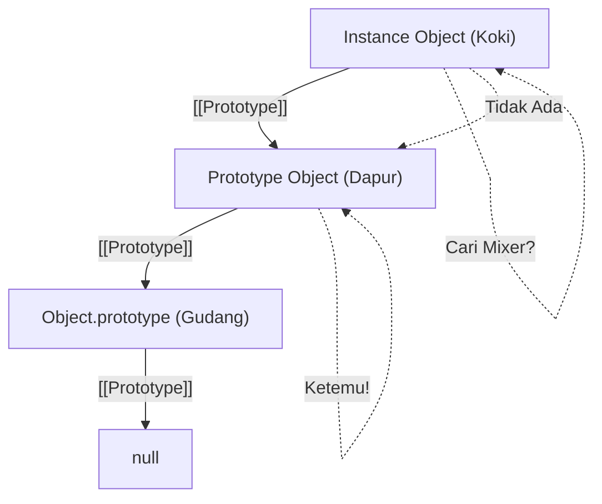

# CH-04: Inheritance Foundations

*Pemetaan ECMA-262: Clause 6.1.7.2 (Object Internal Methods and Slots)*

JavaScript tidak menggunakan kelas tradisional seperti Java untuk pewarisan, melainkan menggunakan delegasi melalui **Prototype Chain**. Bagaimana objek "mengingat" leluhurnya? (Clause 4.4.7 - 4.4.8).

## Mental Model: "Sistem Pinjam-Meminjam"
Bayangkan Anda adalah seorang koki (Object). Anda punya pisau pribadi di tangan (Own Properties). Jika Anda butuh sebuah **Mixer**, Anda akan mencarinya di dapur tempat Anda bekerja (Prototype). 

Jika di dapur tidak ada, dapur tersebut akan mencari di gudang pusat (Prototype dari Prototype). Proses mencari ke atas ini sampai ke "akar" disebut **Prototype Chain**.

---

## 1. Constructor (Clause 4.4.7)
**Constructor** adalah sebuah *function object* yang bertugas menciptakan dan menginisialisasi objek baru. 
- Secara teknis, setiap fungsi (kecuali arrow functions) memiliki properti `.prototype` yang akan "ditempelkan" ke objek baru yang dibuat dengan keyword `new`.

## 2. Prototype (Clause 4.4.8)
Dalam spesifikasi, **Prototype** adalah **"Object that provides shared properties for other objects"**. 
- Ini adalah "gudang bersama" di mana properti dan metode disimpan agar tidak perlu diduplikasi di setiap instance.

---

## 3. Slot Internal `[[Prototype]]`
Hubungan antara objek dan prototipenya disimpan dalam slot internal tersembunyi yang disebut `[[Prototype]]`. 
- Arsitek biasanya berinteraksi dengan slot ini via `Object.getPrototypeOf(obj)` atau `Object.setPrototypeOf(obj)`.

---

## Arsitek Mindset: Delegation over Copying
Memahami bahwa inheritance di JS adalah delegasi membantu Anda menghindari pemborosan memori. Alih-alih memberikan setiap instance method yang sama, taruhlah method tersebut di prototype sehingga seribu instance bisa berbagi satu referensi method yang sama.

---

## Referensi Terkait
- [ECMA-262 Clause 6.1.7.2 - Object Internal Methods and Slots](https://tc39.es/ecma262/#sec-object-internal-methods-and-slots)
- [CH-16: Own vs Inherited Properties](./CH-16_OwnVsInheritedProperties/README.md)

---
> [!IMPORTANT]  
> **Key Takeaway:** Properti `.prototype` (milik fungsi) dan slot internal `[[Prototype]]` (milik objek) adalah dua hal berbeda namun saling terkait dalam proses penciptaan objek baru.
