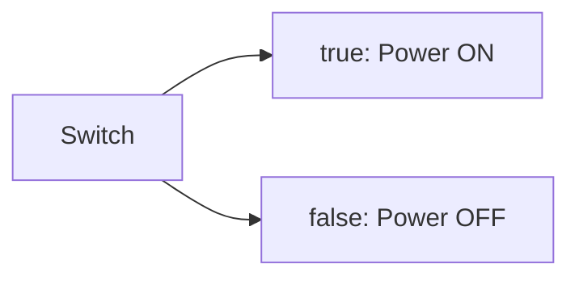
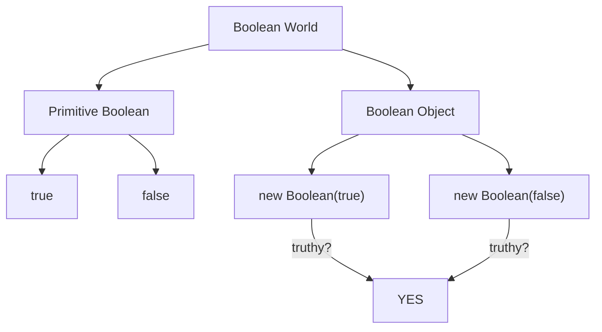

# CH-08: The Boolean Type & Objects

*Pemetaan ECMA-262: Clause 6.1.3 (The Boolean Type)*

Boolean adalah tipe data paling sederhana namun paling fundamental dalam pengambilan keputusan. Spesifikasi mendefinisikannya sebagai himpunan dengan dua anggota saja. (Clause 4.4.17 - 4.4.19).

## 🏗️ The Logic Switch

---

## 1. Boolean Type & Value (Clause 4.4.17 - 4.4.18)
**Boolean Type** adalah tipe data primitif yang terdiri dari tepat dua nilai: `true` dan `false`.
- Nilai-nilai ini digunakan untuk merepresentasikan logika kebenaran dalam operasi kontrol alur (if, while, dll).

## 2. Boolean Object (Clause 4.4.19)
Berbeda dengan nilai primitif, **Boolean Object** adalah member dari *Object Type* yang merupakan instance dari constructor `Boolean` standar.
- **Peringatan Arsitek**: Hampir tidak pernah ada alasan untuk menggunakan `new Boolean()`. Objek boolean (bahkan yang membungkus `false`) akan selalu bernilai *truthy* karena ia adalah sebuah objek.

## 3. Konsep Truthy & Falsy
Meskipun tipe Boolean hanya punya dua nilai, JavaScript bisa mengevaluasi tipe lain sebagai boolean melalui algoritma **ToBoolean**.
- **Falsy**: `undefined`, `null`, `false`, `0`, `-0`, `0n`, `NaN`, dan `""`.
- **Truthy**: Semua nilai lainnya (termasuk semua objek, array kosong, dan string spasi).

---

## Arsitek Mindset: Explicit over Implicit
Gunakan nilai boolean primitif secara eksplisit. Hindari penggunaan Boolean Object karena perilaku *truthiness*-nya yang menjebak. Dalam pengecekan logika, pahami daftar *Falsy values* agar tidak terjadi bug saat menangani angka `0` atau string kosong `""`.

---

## Referensi Terkait
- [ECMA-262 Clause 6.1.3 - The Boolean Type](https://tc39.es/ecma262/#sec-boolean-type)
- [ECMA-262 Clause 7.1.2 - ToBoolean](https://tc39.es/ecma262/#sec-toboolean)

---
> [!NOTE]  
> Eksperimen mengenai evaluasi Truthy/Falsy dan bahaya Boolean Object dapat dilihat di [examples/](./examples/).
