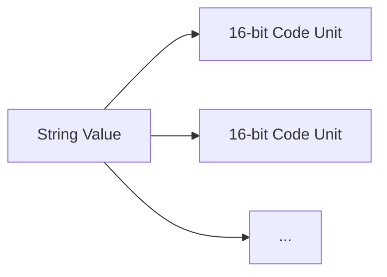
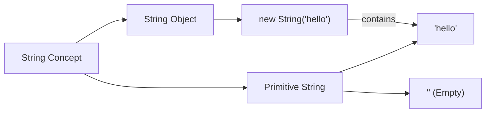

# CH-09: The String Type & Objects

*Pemetaan ECMA-262: Clause 6.1.4 (The String Type)*

String adalah salah satu tipe yang paling sering kita gunakan. Namun di level spesifikasi, ia bukan sekadar "teks", melainkan urutan angka integer 16-bit. (Clause 4.4.20 - 4.4.22).

## Mental Model: "Rangkaian Manik-manik"
Bayangkan sebuah String ibarat sebuah **Rangkaian Manik-manik**. Setiap manik-manik memiliki warna (nilai integer 16-bit) dan urutan yang tetap. Anda tidak bisa mengubah warna manik-manik yang sudah terangkai (**Immutable**), melainkan harus membuat rangkaian baru jika ingin warna yang berbeda.

---

## 🏗️ String Sequence Model

---
- Setiap elemen dalam urutan tersebut mewakili satu unit kode UTF-16.
- **Identitas**: Panjang string didefinisikan oleh jumlah elemen 16-bit di dalamnya.

## 2. String Object (Clause 4.4.22)
**String Object** adalah member dari *Object Type* yang membungkus nilai primitif String.
- Saat Anda mengakses properti seperti `.length` pada string primitif, mesin secara otomatis membungkusnya menjadi String Object.

## 3. Karakteristik Penting
- **Immutability**: String bersifat kekal. Operasi seperti `concat` atau `slice` menghasilkan string baru, tidak mengubah yang lama.
- **Indexing**: Setiap "manik-manik" (code unit) bisa diakses menggunakan indeks berbasis nol.
- **Length**: Properti `length` mencerminkan jumlah unit 16-bit, bukan jumlah karakter visual (ini penting saat menangani Emoji atau karakter unicode kompleks).

---

## Arsitek Mindset: Unicode Awareness
Sebagai arsitek, waspadalah bahwa satu "Karakter" visual bisa terdiri dari dua manik-manik (Surrogate Pairs). Pastikan Anda menggunakan metode seperti `Array.from(string)` atau iterator jika ingin memproses string berdasarkan karakter visual (Code Point) daripada unit biner 16-bit.

---

## Referensi Terkait
- [ECMA-262 Clause 6.1.4 - The String Type](https://tc39.es/ecma262/#sec-string-type)
- [CH-03: Primitive Values & Objects](./CH-03_PrimitiveValuesAndObjects/README.md)

---
> [!NOTE]  
> Demonstrasi manipulasi string dan pengecekan immutability dapat dilihat di [examples/](./examples/).
