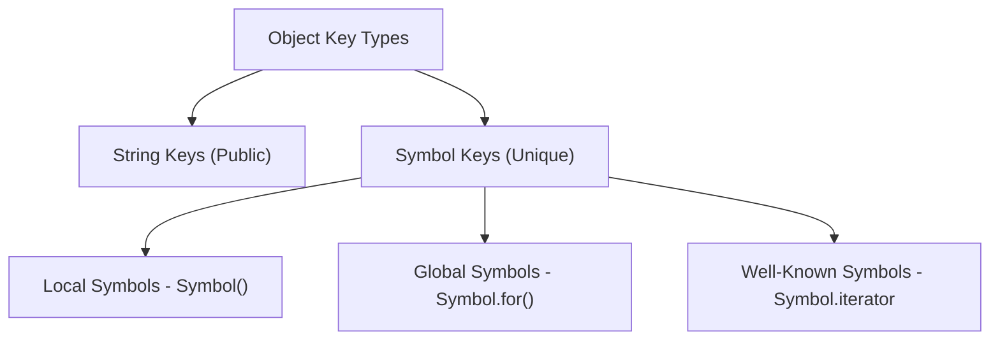

# CH-12: The Symbol Type & Objects

*Pemetaan ECMA-262: Clause 6.1.5 & 4.4.29 - 4.4.30*

Symbol adalah identitas unik yang tidak bisa dipalsukan. Ia lahir untuk memecahkan masalah bentrokan nama properti dalam arsitektur aplikasi skala besar. (Clause 4.4.32 - 4.4.34).

## 🏗️ Symbol Identity Model

```mermaid
graph TD
    S1[Symbol()] --> ID1[Unique Registry ID 1]
    S2[Symbol()] --> ID2[Unique Registry ID 2]
    S1 === S2 --> False[false]
```

---

## 1. Symbol Type & Value (Clause 4.4.32 - 4.4.33)
**Symbol Type** adalah tipe data primitif yang mewakili nilai unik dan non-string yang bisa digunakan sebagai kunci (Key) untuk properti objek.
- **Uniqueness**: Setiap kali Anda memanggil `Symbol()`, Anda membuat nilai yang baru dan unik sejagat raya.
- **Immutability**: Seperti primitif lainnya, Symbol tidak bisa diubah.

## 2. Well-Known Symbols
Spesifikasi mendefinisikan beberapa Symbol khusus (seperti `Symbol.iterator`, `Symbol.toStringTag`) yang digunakan oleh engine untuk mengatur perilaku internal objek. Inilah cara Anda memberikan "kekuatan super" pada objek Anda.



## 3. Karakteristik "Semi-Private"
Properti yang menggunakan Symbol sebagai kuncinya tidak akan muncul dalam iterasi biasa seperti `for...in` atau `Object.keys()`. Ini memberikan tingkat privasi dasar bagi data internal objek tanpa benar-benar menyembunyikannya (karena masih bisa diakses via `Object.getOwnPropertySymbols()`).

---

## Arsitek Mindset: Defensive Programming
Gunakan Symbol untuk metadata internal library Anda agar tidak sengaja tertimpa oleh pengguna library. Gunakan **Well-known Symbols** untuk mengintegrasikan objek Anda dengan fitur bahasa (seperti membuat objek bisa di-iterasi menggunakan `for...of`).

---

## Referensi Terkait
- [ECMA-262 Clause 6.1.5 - The Symbol Type](https://tc39.es/ecma262/#sec-symbol-type)
- [ECMA-262 Clause 14.4 - Symbols](https://tc39.es/ecma262/#sec-symbols)

---
> [!TIP]  
> Eksperimen mengenai keunikan dan privasi Symbol dapat dilihat di [examples/](./examples/).
