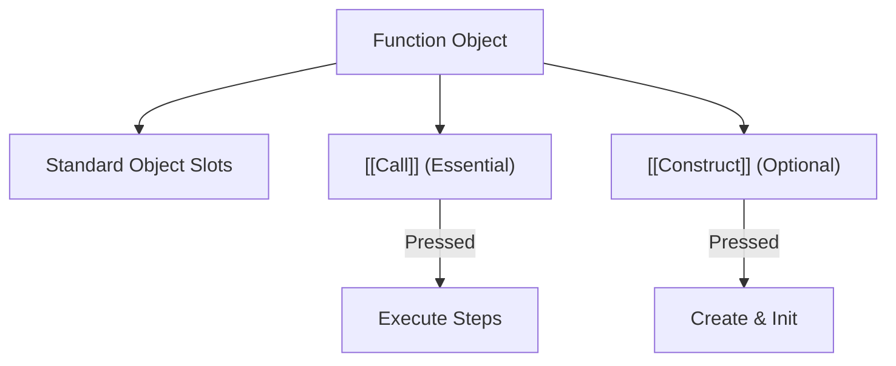
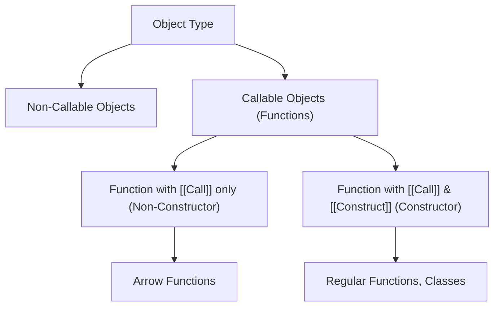

# CH-13: Functions & Callables

*Pemetaan ECMA-262: Clause 6.1.7.2 & 4.4.31 - 4.4.34*

Di JavaScript, fungsi bukanlah "makhluk gaib" yang berbeda dari objek. Mereka adalah objek dengan **Kemampuan Khusus** untuk dieksekusi. (Clause 4.4.34 - 4.4.35).

## 🏗️ Function Object Topology

---

## 1. Function Object (Clause 4.4.34)
Sebuah **Function** adalah anggota dari tipe *Object* yang memiliki metode internal `[[Call]]`.
- **Callable**: Sebutan untuk objek yang memiliki `[[Call]]`. Seluruh fungsi di JS adalah *callable*.

## 2. Constructor Object (Clause 4.4.7)
Sebuah **Constructor** adalah fungsi yang memiliki metode internal tambahan yaitu `[[Construct]]`.
- Metode ini memungkinkan fungsi dipanggil menggunakan keyword `new` untuk menciptakan instance objek baru.
- **Catatan**: Tidak semua fungsi adalah constructor (misal: Arrow Functions tidak punya `[[Construct]]`).

## 3. Built-in Function (Clause 4.4.35)
Fungsi yang sudah disediakan oleh implementasi ECMAScript sejak awal (seperti `eval` atau `parseInt`). Mereka mungkin diimplementasikan menggunakan kode internal engine (seperti C++), bukan kode JavaScript biasa.

---

## Arsitek Mindset: Understanding Execution Slots
Memahami fungsi sebagai objek membantu Anda menyadari bahwa fungsi bisa memiliki properti dan method sendiri (seperti `.name`, `.length`, atau properti kustom Anda). Sebagai arsitek, gunakan *Arrow Functions* saat Anda ingin fungsi murni yang ringan tanpa overhead constructor.

---

## Referensi Terkait
- [ECMA-262 Clause 10.2 - ECMAScript Function Objects](https://tc39.es/ecma262/#sec-ecmascript-function-objects)
- [CH-14: Properties & Methods](./CH-14_PropertiesAndMethods/README.md)

---
> [!NOTE]  
> Demonstrasi perbedaan Callable vs Constructor dapat dilihat di [examples/](./examples/).
