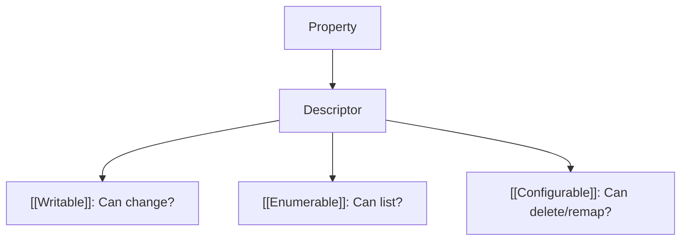
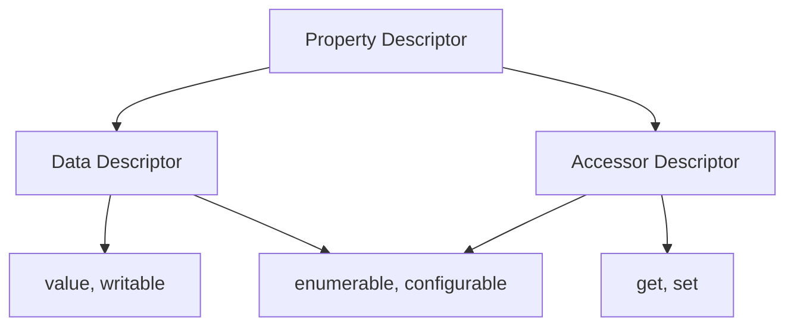

# CH-15: Property Attributes

*Pemetaan ECMA-262: Clause 6.1.7.1 & 4.4.40*

Jika properti adalah "Pintu", maka **Attributes** adalah "Gembok", "Alarm", dan "Engsel"-nya. Spesifikasi menggunakan atribut untuk mendefinisikan karakteristik perilaku dari sebuah properti. (Clause 4.4.39).

## 🏗️ Property Descriptor Certificate

---

## 1. Property Attributes (Clause 4.4.39)
**Attribute** adalah nilai internal yang mendefinisikan karakteristik sebuah properti. Ada dua jenis utama properti di JavaScript, masing-masing memiliki set atribut yang berbeda:

### A. Data Properties
Memiliki nilai data (seperti angka atau string).
- `[[Value]]`: Nilai sebenarnya.
- `[[Writable]]`: Jika `false`, nilai tidak bisa diubah.
- `[[Enumerable]]`: Jika `true`, muncul dalam loop `for...in`.
- `[[Configurable]]`: Jika `false`, properti tidak bisa dihapus atau diubah tipenya.

### B. Accessor Properties (Getter/Setter)
Tidak memiliki nilai langsung, melainkan fungsi untuk mengambil/mengubah nilai.
- `[[Get]]`: Fungsi yang dipanggil saat properti dibaca.
- `[[Set]]`: Fungsi yang dipanggil saat properti diisi.
- `[[Enumerable]]` & `[[Configurable]]`.

---

## Arsitek Mindset: Immutable Objects & Security
Sebagai arsitek, pemahaman atribut sangat penting untuk menciptakan objek yang aman (Defensive Programming). Gunakan `Object.freeze()` atau `Object.defineProperty()` untuk mengunci properti krusial agar tidak bisa diubah oleh bagian kode lain secara tidak sengaja.

---

## Referensi Terkait
- [ECMA-262 Clause 6.1.7.1 - Property Attributes](https://tc39.es/ecma262/#sec-property-attributes)
- [RAK-01-core/SR-03_InternalSlots](../../../README.md)

---
> [!IMPORTANT]  
> Default untuk properti yang dibuat via penugasan biasa (`obj.a = 1`) adalah semua atribut bernilai `true`. Namun, properti yang dibuat via `defineProperty` default-nya adalah `false`.
