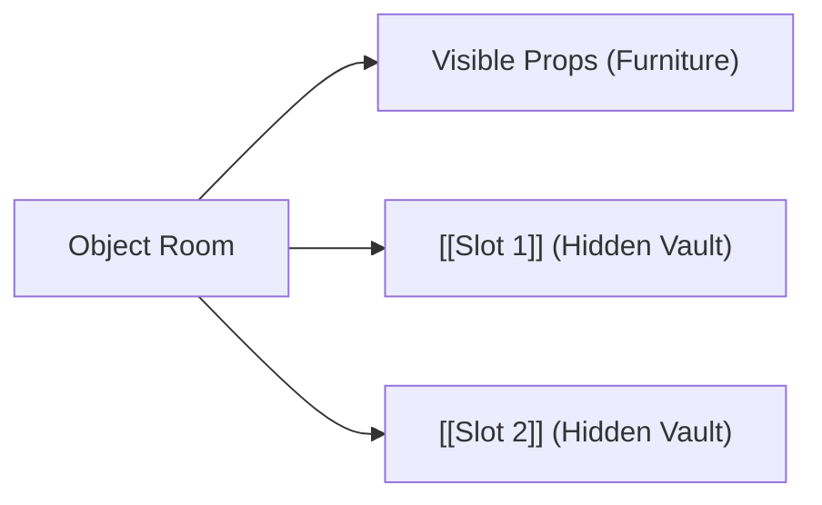
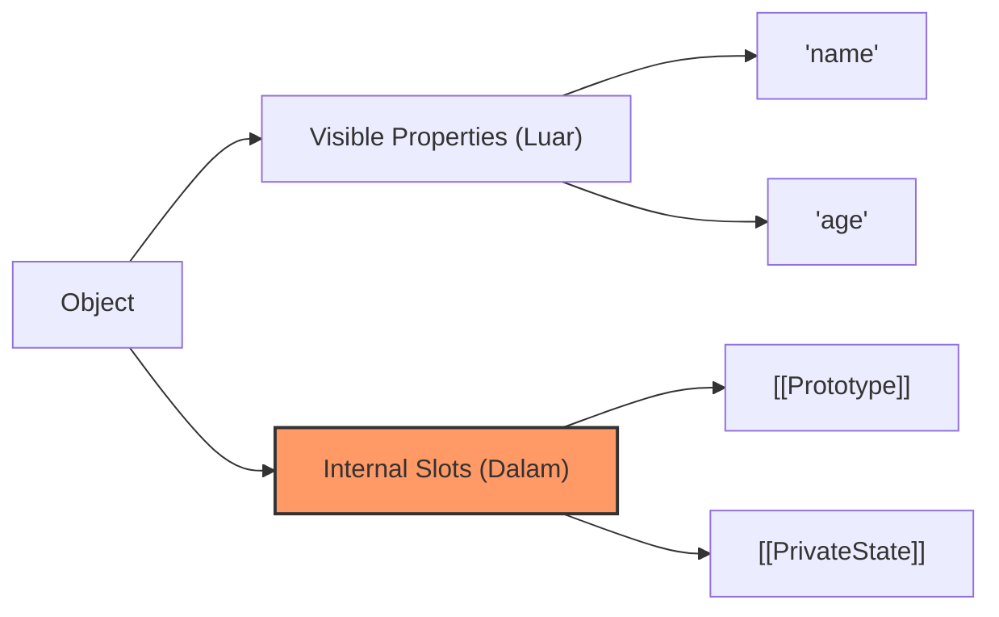

# CH-17: Internal Slots

*Pemetaan ECMA-262: Clause 6.1.7.2 & 4.4.43*

Pernahkah Anda bertanya-tanya di mana JavaScript menyimpan data "rahasia" seperti target dari sebuah `Proxy` atau state dari sebuah `Promise`? Jawabannya adalah **Internal Slots**. (Clause 4.4.43).

## 🏗️ Internal Slot Vault

---

- Tamu tidak bisa melihat brankas itu (`[[Slot]]`).
- Hanya pengelola gedung (Mesin JS) yang bisa membukanya untuk menyimpan data krusial yang menjamin keamanan sistem.

---

## 1. Definisi Formal (Clause 4.4.43)
**Internal Slot** adalah komponen internal dari sebuah objek yang digunakan oleh spesifikasi untuk menyimpan data internal.
- **Bukan Properti**: Slot ini bukan bagian dari *property collection* dan tidak bisa diakses melalui delegasi prototipe.
- **Notasi**: Dalam spesifikasi, slot ditulis dengan kurung siku ganda, contoh: `[[Prototype]]`, `[[PromiseState]]`.

## 2. Kenapa Slot Begitu Penting?
Tanpa slot internal, JavaScript tidak bisa menjamin integritas data. Jika `[[Prototype]]` adalah properti biasa, kode yang nakal bisa sengaja merusaknya dan meruntuhkan seluruh sistem pewarisan. Slot memastikan data tersebut "Private by Spec".

---

## Arsitek Mindset: Understanding Inaccessible State
Sebagai arsitek, menyadari keberadaan slot sangat penting saat melakukan *debugging* objek kompleks seperti `Map`, `Set`, atau `Promise`. Anda tidak bisa melihat isinya langsung dengan `console.log` yang dangkal, karena data mereka hidup di dalam slot. Pahami bahwa "Invisibility" adalah fitur keamanan spesifikasi.

---

## Referensi Terkait
- [ECMA-262 Clause 6.1.7.2 - Internal Slots](https://tc39.es/ecma262/#sec-object-internal-methods-and-slots)
- [CH-04: Inheritance Foundations](../CH-04_InheritanceFoundations/README.md)

---
> [!IMPORTANT]
> Slot internal tidak bisa diakses secara langsung via JavaScript (kecuali melalui API khusus seperti `Object.getPrototypeOf`). Mereka adalah properti "gaib" yang hanya tunduk pada algoritma spesifikasi.
