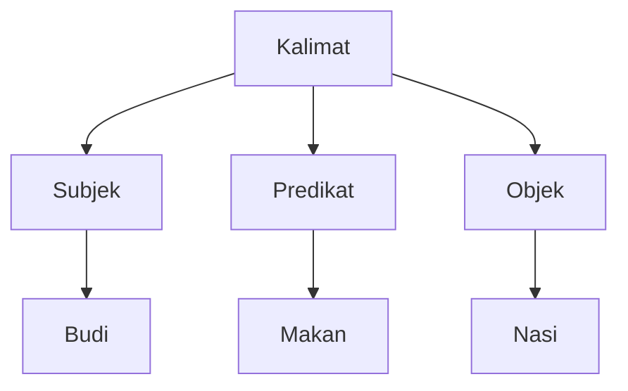

# CH-01: Context-Free Grammars

Bagaimana aturan main diatur agar sebuah bahasa bisa dipahami oleh mesin? (Clause 5.1.1).

## 🏗️ CFG Branching Model

---

## 1. Komponen Utama (Clause 5.1.1)
Dalam spesifikasi, CFG dibagi menjadi dua jenis simbol:

1.  **Non-terminal Symbols** (Abstraksi):
    - Simbol yang ditulis dengan huruf miring atau kurung siku ganda (misal: *Statement*, *Expression*).
    - Berfungsi sebagai "wadah" atau "cetakan" yang bisa dipecah lagi menjadi bagian yang lebih kecil.
2.  **Terminal Symbols** (Nyata):
    - Karakter atau kata kunci riil (misal: `let`, `if`, `{`, `;`).
    - Merupakan ujung dari hirarki; tidak bisa dipecah lagi.

## 2. Kenapa "Context-Free"?
Disebut *Context-Free* karena aturan substitusinya berlaku di mana saja, tanpa peduli apa yang ada di kiri atau kanannya. Jika spesifikasi bilang *Expression* bisa berubah jadi *Number*, maka itu berlaku universal di dalam blok kode manapun.

---

## Arsitek Mindset: The Parser's Compass
Sebagai arsitek, memahami CFG membantu Anda mengerti alasan di balik kesalahan paling umum: **SyntaxError**. 
Saat Anda melihat pesan tersebut, itu artinya Parser mesin JS sedang mencoba mencocokkan kode Anda ke dalam pohon aturan CFG, namun gagal menemukan "jalur" yang valid.

[Lihat Simulasi Kode CFG](./examples/simple_cfg_sim.js)

---
> [!IMPORTANT]
> Urutan penulisan kode di JavaScript bukanlah saran, melainkan hukum fisika yang didefinisikan oleh pohon CFG ini.
