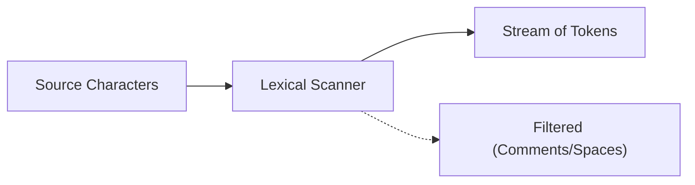

# CH-02: Lexical and RegExp Grammars

Bagaimana mesin membedakan antara "Teks Biasa" dan "Perintah"? (Clause 5.1.2).

## 🏗️ Lexical Scanning Flow

---

## 1. Lexical vs Syntactic
Penting untuk membedakan dua tahap ini:
- **Lexical Grammar** (Clause 5.1.2): Bekerja di level karakter. Menentukan pola untuk *tokens* seperti `if`, `var`, `123`, atau `+`. Inputnya adalah string mentah, outputnya adalah *Tokens*.
- **Syntactic Grammar**: Bekerja di level *tokens*. Menentukan bagaimana *tokens* tersebut disusun menjadi struktur yang bermakna (seperti `if (x) { ... }`).

## 2. Input Elements
Di level terendah, spesifikasi mendefinisikan elemen input sebagai:
- **Tokens**: Keyword, Identifier, Punctuator, StringLiteral.
- **Divisor**: Spasi, pindah baris (Line Terminator), dan komentar. Komentar dan spasi seringkali dibuang oleh Lexer setelah proses scanning selesai.

---

## Arsitek Mindset: The Regular Expression of Life
Hampir seluruh aturan di Lexical Grammar dapat direpresentasikan dengan **Regular Expressions**. Itulah sebabnya pemahaman Regex sangat krusial bagi seorang arsitek bahasa; karena itulah cara mesin JS membedah niat Anda dari tumpukan karakter mentah.

[Lihat Demo Tokenizer Sederhana](./examples/tokenizer_demo.js)

---
> [!TIP]
> Pernahkah Anda bertanya kenapa spasi tidak berpengaruh di JS? Itu karena Lexical Grammar mengklasifikasikannya sebagai *White Space* yang biasanya diabaikan oleh parser setelah tahap identifikasi token selesai.
