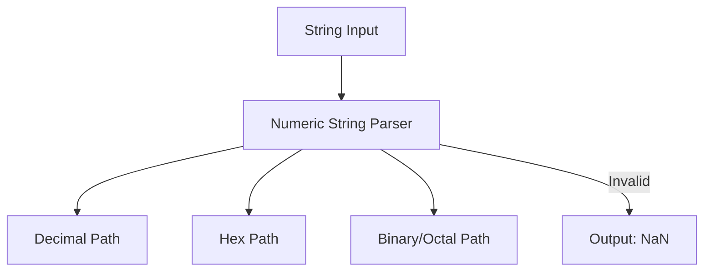

# CH-03: The Numeric String Grammar

Bagaimana sebuah deretan teks bisa berubah menjadi angka yang bisa dihitung? (Clause 5.1.3).

## 🏗️ Numeric Conversion Logic

---

## 1. Aturan Dasar (Productions)
Grammar ini mendefinisikan beberapa jalur utama untuk angka:
- **StringNumericLiteral**: Bisa berupa spasi, diikuti oleh `StrNumericLiteral`, diikuti spasi.
- **HexIntegerLiteral**: String yang diawali `0x` atau `0X`.
- **DecimalLiteral**: Angka desimal biasa, bisa mengandung titik (`.`) atau eksponen (`e`).

## 2. Kenapa Harus Dibedakan?
Lexical Grammar harus sangat berhati-hati agar tidak salah mengira angka sebagai variabel. Sedangkan Numeric String Grammar lebih fokus pada validasi input string pengguna yang ingin dikonversi secara eksplisit. Jika input tidak cocok dengan satu pun aturan di sini, JavaScript akan mengembalikan `NaN`.

---

## Arsitek Mindset: Precise Conversion
Seorang arsitek harus tahu bahwa `Number("0xG")` adalah `NaN` bukan karena "Error", tapi karena string tersebut gagal melewati validasi produksi `HexIntegerLiteral` yang hanya mengizinkan `[0-9a-fA-F]`. Memahami grammar ini menghindarkan Anda dari bug konversi data yang misterius.

[Lihat Validasi Logika Angka](./examples/numeric_parsing_rules.js)

---
> [!IMPORTANT]
> Spasi di awal dan akhir string diperbolehkan dalam Numeric String Grammar (diabaikan), namun karakter non-angka di tengah akan langsung menggagalkan seluruh proses parsing.
