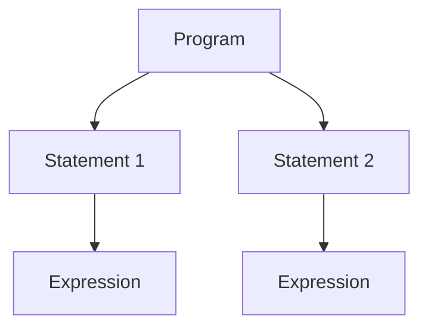

# CH-04: The Syntactic Grammar

Bagaimana kumpulan kata kunci berubah menjadi struktur logika yang utuh? (Clause 5.1.4).

## 🏗️ Structural Blueprint (AST)

---

## 1. Lingkup Kerja (Clause 5.1.4)
Syntactic Grammar bekerja dengan input berupa aliran **Tokens** dari Lexical Grammar. Ia tidak lagi peduli apakah ada spasi atau komentar di antaranya; fokusnya adalah urutan logis:
- **Statements**: Instruksi yang melakukan tindakan (misal: `if`, `while`, `return`).
- **Expressions**: Unit kode yang menghasilkan nilai (misal: `a + b`, `true`).
- **Program**: Kumpulan dari elemen-elemen di atas yang membentuk satu kesatuan kode.

## 2. Abstract Syntax Tree (AST)
Hasil akhir dari pengecekan Syntactic Grammar biasanya direpresentasikan dalam bentuk pohon (Tree). Setiap simpul di pohon tersebut mewakili aturan grammar tertentu. Jika kode Anda tidak bisa dibentuk menjadi pohon yang utuh menurut aturan spec, maka terjadilah **SyntaxError**.

---

## Arsitek Mindset: Structural Integrity
Memahami Syntactic Grammar berarti Anda memahami "Hukum Tata Ruang" dalam JavaScript. Anda akan tahu persis kenapa Anda tidak bisa menaruh `else` tanpa `if`, atau kenapa `return` harus berada di dalam fungsi. Ini bukan tentang "kebiasaan", tapi tentang kepatuhan pada aturan produksi Syntactic Grammar.

[Lihat Simulasi Validasi Struktur](./examples/syntactic_validation.js)

---
> [!IMPORTANT]
> Tahap ini adalah gerbang terakhir sebelum kode Anda mulai diproses secara semantik (diberi makna). Jika strukturnya goyah di sini, program tidak akan pernah berjalan.
