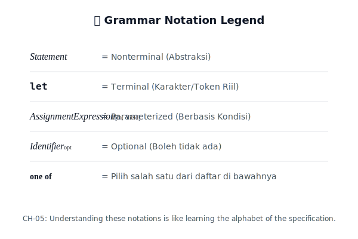

# CH-05: Grammar Notation Overview

Bagaimana cara membaca simbol-simbol aneh di spesifikasi? (Clause 5.1.5).

## Dasar Pemikiran: "Legenda Peta" 📖
Membaca spesifikasi ECMA-262 seringkali terasa seperti membaca bahasa asing. Itu karena spesifikasi menggunakan sistem notasi khusus (**Meta-language**) untuk mendefinisikan aturan mainnya sendiri. Bagian ini akan memberikan legenda untuk memahami simbol-simbol tersebut.

---

## 1. Notasi Produksi (Clause 5.1.5)
Setiap aturan (Production) memiliki struktur:
`Nonterminal : AlternativeSymbol`
- **Nonterminal**: Sisi kiri (yang ingin didefinisikan), biasanya ditulis dalam huruf miring.
- **:** Tandanya ("Didefinisikan sebagai").
- **AlternativeSymbol**: Sisi kanan (isinya), bisa berupa terminal atau nonterminal lain.

## 2. Parameter dan Kondisi
Beberapa produksi memiliki parameter tambahan yang ditulis dalam tanda kurung siku (subscript), seperti `Expression[In]`. Ini menandakan bahwa aturan tersebut berubah bergantung pada konteks (misal: apakah kita berada di dalam *Yield* atau *Await context*).

---

## Arsitek Mindset: Spec-Literacy
Seorang arsitek tingkat senior tidak hanya tahu cara menulis kode, tapi tahu cara membaca sumber hukum kode tersebut. Menguasai notasi di CH-05 adalah pintu masuk Anda untuk menjadi *Spec-Literate*. Anda tidak lagi bergantung pada tutorial, karena Anda bisa membaca langsung "Blueprint" aslinya.

---
> [!IMPORTANT]
> Jangan biarkan simbol miring atau *subscript* mengintimidasi Anda. Itu hanyalah sistem pelabelan yang sangat logis untuk menjaga agar spesifikasi tetap ringkas namun presisi.
