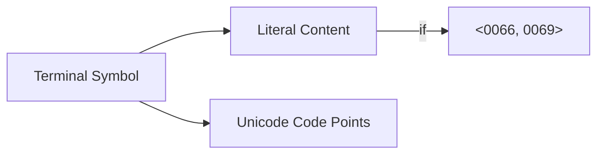

# CH-06: Terminal Symbols

Batu bata terkecil dari bahasa JavaScript. (Clause 5.1.5.1).

## 🏗️ Terminal Symbol Anatomy

---

## 1. Karakteristik Utama (Clause 5.1.5.1)
Dalam dokumen ECMA-262, Terminal Symbols memiliki ciri khas:
- **Font Fixed-Width**: Selalu ditulis menggunakan font mesin (seperti `if`, `while`, `+`).
- **Literal**: Mewakili urutan karakter Unicode yang spesifik. Misalnya, terminal `for` mewakili karakter Unicode <0066, 006F, 0072>.

## 2. Peran dalam Produksi
Terminal adalah "tujuan akhir" dari setiap aturan grammar. Sebuah instruksi hanya dianggap valid jika pada akhirnya bisa dipecah menjadi deretan Terminal yang diakui oleh spec.

Contoh `IfStatement`:
`IfStatement : if ( Expression ) Statement`
- `if`, `(`, dan `)` adalah **Terminal**. Anda tidak bisa menggantinya dengan `jika` atau `[` tanpa melanggar hukum dasar bahasa ini.

---

## Arsitek Mindset: The Bit-Level Precision
Seorang arsitek memahami bahwa komputer tidak membaca "kata", ia membaca "angka" (Unicode code points). Memahami Terminal Symbols berarti Anda menghargai presisi bit-level. Itulah sebabnya `Case-Sensitivity` sangat krusial; karena terminal `let` (<006C, 0065, 0074>) sama sekali berbeda dengan `Let` (<004C, 0065, 0074>) di mata spesifikasi.

---
> [!IMPORTANT]
> Begitu sebuah simbol masuk kategori Terminal, ia menjadi sakral. Kesalahan satu karakter saja pada terminal akan memicu kegagalan parser instan (**SyntaxError**).
