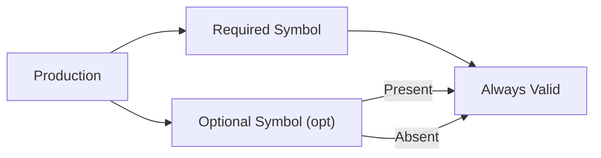

# CH-08: Optional Symbols

Sesuatu yang boleh ada, tapi tidak wajib. (Clause 5.1.5.3).

## 🏗️ Optionality Logic Flow

---

## 1. Notasi: `subscript opt`
Dalam dokumen ECMA-262, jika sebuah simbol (baik terminal maupun nonterminal) diikuti oleh subskrip `opt`, artinya simbol tersebut tidak harus hadir agar produksi tersebut dianggap valid.

Contoh `VariableDeclaration`:
`VariableDeclaration : BindingIdentifier Initializer_opt`
Artinya:
- `let x = 10;` -> `Initializer` hadir (Valid).
- `let x;` -> `Initializer` tidak ada (Juga Valid).

## 2. Mengapa Sangat Penting?
Tanpa notasi `opt`, spesifikasi akan membengkak luar biasa. Kita harus menulis aturan terpisah untuk setiap kombinasi fitur. `opt` memungkinkan arsitek bahasa mendefinisikan ribuan variasi syntax hanya dalam satu baris yang padat dan presisi.

---

## Arsitek Mindset: Defensive Parsing
Memahami simbol opsional membantu Anda menulis kode yang lebih "tahan banting". Saat Anda tahu bahwa sebuah bagian dari syntax adalah opsional, Anda tidak akan kaget jika bagian tersebut tidak muncul dalam alur parsing. Ini adalah dasar dari fitur-fitur modern seperti *Optional Chaining* (`?.`) atau *Nullish Coalescing* (`??`).

[Lihat Simulasi Logika Opsional](./examples/optional_logic.js)

---
> [!TIP]
> Saat membaca spec, anggaplah `opt` sebagai tanda tanya `?` dalam Regular Expression. Ia memberikan izin kepada parser untuk "melewatkan" simbol tersebut jika tidak ditemukan dalam aliran token.
