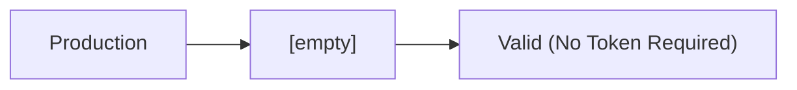

# CH-11: The [empty] Notation

Mewakili ketiadaan simbol secara eksplisit. (Clause 5.1.5.6).

## 🏗️ The Empty Match Model

---

## 1. Notasi: `[empty]` (Clause 5.1.5.6)
Jika sebuah alternatif produksi hanya berisi simbol `[empty]`, artinya Nonterminal tersebut tidak membutuhkan input apa pun untuk dianggap sukses (cocok).

Contoh `Elision` (tanda koma kosong dalam array):
`Elision :`
  `,`
  `Elision ,`

Meskipun terlihat sederhana, di balik layar spesifikasi sering menggunakan logika "kosong" ini untuk menangani struktur opsional yang kompleks.

## 2. Kenapa Harus Eksplisit?
Walaupun ada cara implisit untuk menyatakan kekosongan (seperti tidak menuliskan alternatif sama sekali), penggunaan `[empty]` memberikan kejelasan bagi pengembang engine dan pembaca spek bahwa kekosongan tersebut adalah **sengaja** dan memiliki makna semantik.

---

## Arsitek Mindset: The Value of Zero
Seorang arsitek memahami bahwa `null` atau `empty` bukan berarti error. Memahami `[empty]` membantu Anda memahami bagaimana JavaScript menangani *trailing commas* atau pemanggilan fungsi tanpa argumen (`func()`). Anda akan belajar bahwa dalam grammar, ketiadaan sering kali memiliki bobot yang sama dengan kehadiran.

[Lihat Simulasi Kecocokan [empty]](./examples/empty_match_sim.js)

---
> [!TIP]
> Saat Anda melihat `[empty]` di spec, bayangkan sebuah "jalan tol" yang tidak memiliki gerbang. Anda bisa lewat begitu saja tanpa harus menyerahkan tiket (token) apa pun.
