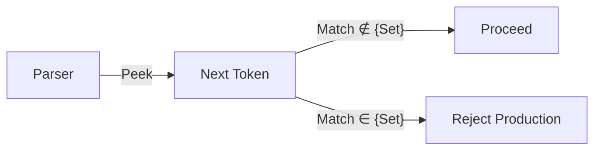

# CH-12: Lookahead Restrictions

Bagaimana mesin JavaScript "mengintip" masa depan? (Clause 5.1.5.7).

## 🏗️ Lookahead Guard Radar

---

## 1. Notasi: `[lookahead ∉ { ... }]`
Simbol `∉` (bukan elemen dari) menandakan bahwa produksi ini hanya boleh dilanjutkan jika token berikutnya **BUKAN** salah satu dari simbol di dalam kurung kurawal.

Contoh `ExpressionStatement`:
`ExpressionStatement : [lookahead ∉ { {, function, class, let [ }] Expression ;`
Artinya: Sebuah statement ekspresi tidak boleh dimulai dengan `{` karena jika ya, parser akan bingung apakah itu awal dari *Object Literal* atau *Block Statement*.

## 2. Mengapa Sangat Penting?
Lookahead adalah pahlawan tanpa tanda jasa yang menyelesaikan ambiguitas tata bahasa. Tanpa lookahead, bahasa JavaScript akan menjadi sangat kaku atau sangat membingungkan bagi mesin parser. Lookahead memberikan fleksibilitas bagi kita (pengembang) sambil tetap menjaga presisi bagi mesin.

---

## Arsitek Mindset: Resolving Ambiguity
Seorang arsitek tingkat senior tahu bahwa ambiguitas adalah musuh utama sistem yang stabil. Memahami Lookahead Restrictions memberikan Anda wawasan tentang batasan sintaksis. Anda akan mengerti kenapa Anda perlu membungkus objek literal dengan kurung `({ a: 1 })` saat menggunakan arrow function atau statement tertentu—itu semua karena aturan Guard Lookahead ini.

[Lihat Simulasi Validator Lookahead](./examples/lookahead_validator.js)

---
> [!IMPORTANT]
> Lookahead adalah satu-satunya momen di mana spesifikasi memberikan kemampuan "meramal" bagi parser untuk memastikan jalur yang diambil adalah jalur yang benar secara hukum bahasa.
