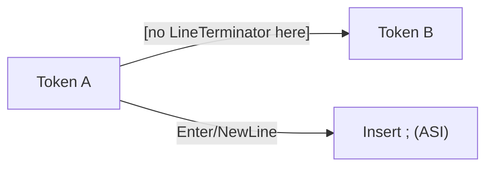

# CH-13: Line Terminator Restrictions

Rahasia di balik Automatic Semicolon Insertion (ASI). (Clause 5.1.5.8).

## 🏗️ ASI Barrier Model



---

## 1. Notasi: `[no LineTerminator here]`
Jika notasi ini muncul di antara dua simbol dalam sebuah produksi, artinya parser tidak akan menganggap produksi tersebut cocok jika ada satu atau lebih karakter *Line Terminator* di antara kedua simbol tersebut.

Contoh `ReturnStatement`:
`ReturnStatement : return [no LineTerminator here] Expression ;`

Jika Anda menulis:
```javascript
return 
  "Data";
```
Parser akan berhenti setelah kata `return`, memicu ASI (Automatic Semicolon Insertion), dan membuat fungsi Anda mengembalikan `undefined`. Kata `"Data"` akan dianggap sebagai statement baru yang tidak pernah dieksekusi.

## 2. Kenapa Aturan Ini Ada?
Tanpa batasan ini, sintaks JavaScript akan menjadi sangat ambigu karena fitur semicolon opsional. Aturan ini menjaga agar kita tidak salah memberikan instruksi kepada mesin hanya karena tata letak baris yang buruk.

---

## Arsitek Mindset: Understanding ASI
Seorang arsitek tingkat senior tidak menebak-nebak di mana semicolon akan muncul. Ia memahami aturan `[no LineTerminator here]` sebagai fondasi dari perilaku ASI. Dengan memahami bab ini, Anda tidak akan lagi terjebak oleh "bug hantu" yang disebabkan oleh pemisahan baris pada `return`, `yield`, `continue`, `break`, atau operator `++`/`--`.

---
> [!TIP]
> Saat membaca spec, carilah teks dalam kurung siku `[no LineTerminator here]`. Itu adalah peringatan keras bahwa Enter adalah karakter terlarang di titik tersebut.
