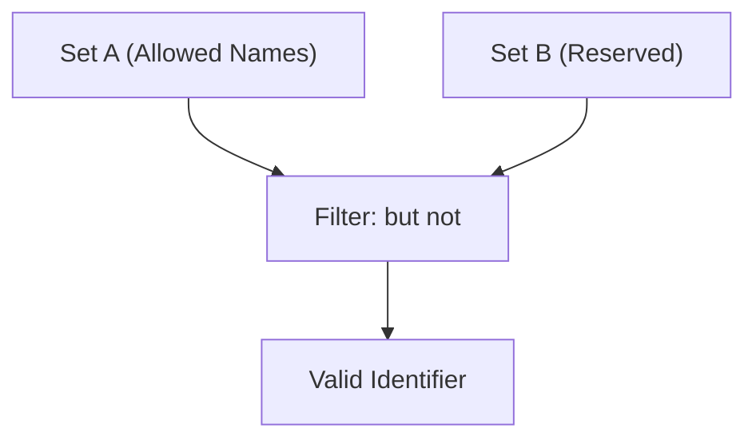

# CH-14: The "but not" Notation

Filter keamanan untuk kategori yang terlalu luas. (Clause 5.1.5.9).

## 🏗️ Set Exclusion Logic

---

## 1. Notasi: `A but not B`
Jika sebuah produksi menggunakan frasa `but not`, artinya simbol tersebut valid hanya jika ia memenuhi kriteria simbol **A**, namun sama sekali tidak cocok dengan kriteria simbol **B**.

Contoh paling kritikal:
`Identifier : IdentifierName but not ReservedWord`

Artinya:
- Anda boleh memberi nama variabel `pencatat` karena itu adalah *IdentifierName* dan bukan *ReservedWord*.
- Anda **TIDAK BOLEH** memberi nama variabel `let` atau `class`, meskipun mereka adalah nama yang valid secara teknis, karena mereka termasuk dalam filter *ReservedWord*.

## 2. Mengapa Ini Penting?
Tanpa notasi ini, bahasa JavaScript akan menjadi sangat rentan. Kita bisa saja mendefinisikan ulang keyword inti bahasa sebagai nama variabel, yang pastinya akan merusak seluruh logika engine. `but not` adalah benteng pertahanan terakhir yang menjaga integritas kosa kata bahasa.

---

## Arsitek Mindset: Defensive Vocabulary
Seorang arsitek memahami bahwa pembatasan adalah bentuk perlindungan. Memahami `but not` membantu Anda menghargai kenapa kata-kata tertentu dilarang digunakan di tempat tertentu. Ini bukan sekadar aturan acak, melainkan filter sistemis yang memastikan tidak ada ambiguitas antara data (variabel) dan instruksi (keyword).

---
> [!IMPORTANT]
> Saat Anda melihat `but not` di spesifikasi, anggaplah itu sebagai tanda kurung "minus" dalam matematika: `Result = All_Possible - Forbidden_Set`.
