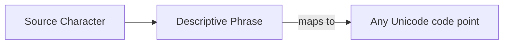

# CH-15: Descriptive Phrases

Jembatan antara bahasa formal dan realitas Unicode. (Clause 5.1.5.10).

## 🏗️ Hybrid Specification Model

---

## 1. Karakteristik Frasa Deskriptif
Jika sebuah produksi tidak bisa dijelaskan dengan Terminal atau Nonterminal biasa, spesifikasi menggunakan teks bahasa Inggris yang deskriptif.

Contoh paling umum (Clause 6):
`SourceCharacter : any Unicode code point`

Alih-alih membuat ribuan baris produksi untuk setiap karakter Unicode, spesifikasi cukup memberikan satu kalimat sakti yang merujuk pada standar Unicode eksternal.

## 2. Mengapa Ini Penting?
Ini adalah bab penutup dari sistem notasi karena ia adalah "katup pengaman" terakhir. Ia memungkinkan spesifikasi ECMAScript untuk tetap kompatibel dengan standar lain (seperti Unicode, IETF, atau ISO) tanpa harus menduplikasi seluruh isi standar tersebut ke dalam dokumen ECMA-262.

---

## Penutup Buku 02: Grammar Notation System
Selamat! Anda kini telah memiliki kacamata seorang Arsitek Bahasa. Anda tidak lagi hanya melihat *syntax*, tetapi Anda melihat *hukum*. Setiap kali Anda menulis kode, Anda sekarang tahu bahwa di balik setiap baris tersebut ada blueprint yang sangat presisi yang menjaga agar JavaScript tetap menjadi bahasa yang kita kenal.

---
## Arsitek Mindset: The Hybrid Language
Seorang arsitek tingkat senior menghargai kombinasi antara kekakuan (formal grammar) dan fleksibilitas (descriptive phrases). Memahami kapan spesifikasi menggunakan simbol murni dan kapan ia menggunakan deskripsi manusia adalah kunci untuk navigasi spec yang efektif.

---
> [!IMPORTANT]
> **Final Takeaway:** Grammar adalah kerangka bangunan, sedangkan Descriptive Phrases adalah instruksi khusus yang menjaga agar bangunan tersebut tetap terhubung dengan lingkungannya.
