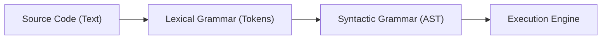

# BK-02: Grammar Notation System (Clause 5.1)

> [!IMPORTANT]
> **Sinopsis:** Mempelajari "Blueprint" yang merancang bahasa JavaScript. Tanpa memahami sistem notasi ini, spesifikasi ECMA-262 akan terlihat seperti kumpulan kode acak yang tidak masuk akal. 

## 🏗️ Grammar Input/Output Pipeline

## 1. Mengapa Buku Ini Penting?
Coba bayangkan Anda ingin membangun gedung pencakar langit tanpa tahu cara membaca denah arsiteknya. Mustahil, bukan? 

Spesifikasi ECMAScript menggunakan sekumpulan simbol dan aturan khusus (tata bahasa) untuk mendefinisikan apa yang valid dan apa yang tidak dalam JavaScript. Buku ini akan mengajarkan Anda cara membedah blueprint tersebut—mulai dari simbol mentah (*Terminal*) hingga mekanisme radar canggih (*Lookahead*).

---

## Intisari Materi:
1.  **Dunia Tata Bahasa**: Memahami perbedaan antara *Lexical Grammar* (tokenizer) dan *Syntactic Grammar* (pohon eksekusi).
2.  **Mekanisme Kontrol**: Membongkar cara spesifikasi menggunakan parameter konteks seperti `[Yield]` dan `[Await]` untuk mengubah perilaku kode secara dinamis.
3.  **Hukum Batasan**: Membedah aturan-aturan pembatas seperti `[no LineTerminator here]` yang menjadi dasar dari fitur ASI (*Automatic Semicolon Insertion*).

---

## Orientasi Navigasi:
Keterangan teknis mengenai urutan bab dan klausul spesifik dapat Anda temukan di halaman navigasi pusat.

### 🧭 [Buka Daftar Isi & Peta Bab (TOC)](./docs/contents.md)
*Gunakan peta ini untuk melacak detail notasi yang ingin Anda kuasai.*

---
> [!NOTE]  
> Buku ini mengikuti standar granulasi ES2025 terbaru untuk Clause 5.1.
